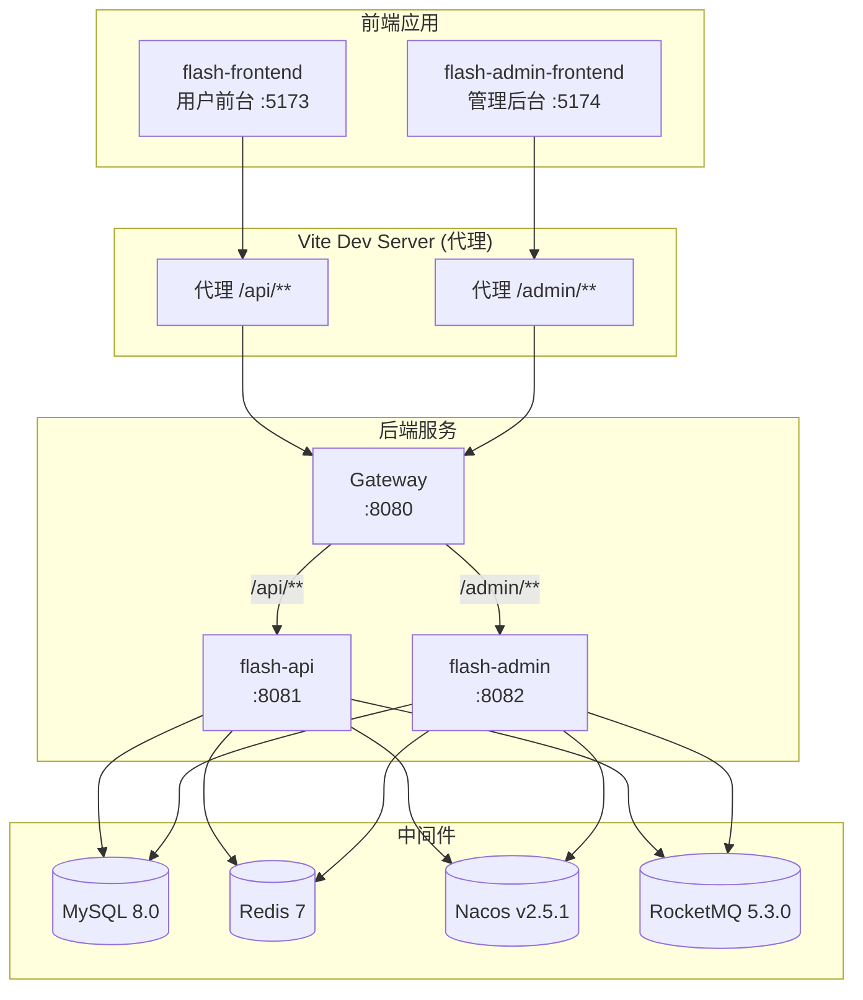
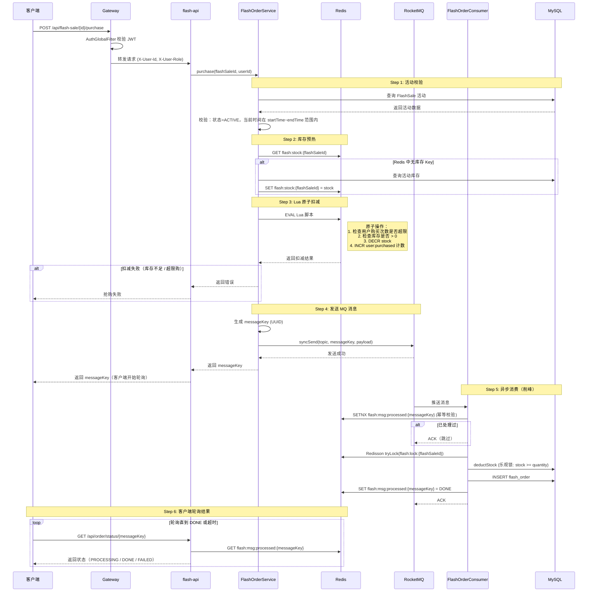

# Flash Sale 系统架构文档

> 本文档面向新入职开发者，帮助你快速理解秒杀系统的整体架构、核心链路和各模块职责。

---

## 1. 系统架构总览



**请求流转路径：** 浏览器 → Vite Dev Server（开发环境代理） → Gateway（统一入口、鉴权、路由转发） → 后端业务服务 → 中间件。

---

## 2. 技术栈

| 分类 | 技术 | 版本 | 说明 |
|------|------|------|------|
| 语言 | Java | 21 | 主开发语言 |
| 框架 | Spring Boot | 3.2.0 | 应用基础框架 |
| 微服务 | Spring Cloud | 2023.0.0 | 微服务基础设施 |
| 微服务 | Spring Cloud Alibaba | 2023.0.1.0 | Nacos 集成 |
| ORM | MyBatis-Plus | 3.5.5 | 数据库访问层 |
| 数据库 | MySQL | 8.0 | 关系型数据库 |
| 缓存 | Redis 7 + Redisson | 3.24.3 | 缓存 + 分布式锁 |
| 消息队列 | RocketMQ Server | 5.3.0 | 异步削峰 |
| 消息队列 | rocketmq-spring-boot-starter | 2.3.0 | MQ 客户端 |
| 注册中心 | Nacos | v2.5.1 | 服务注册与配置中心 |
| 认证 | jjwt | 0.12.3 | JWT 令牌生成与校验 |
| 前端（用户端） | Vue 3 + Vite | - | 用户前台 SPA |
| 前端（管理端） | Vue 3 + Element Plus | - | 管理后台 SPA |
| 容器化 | Docker | - | 中间件部署 |

---

## 3. 模块职责

项目采用 Maven 多模块结构，各模块职责如下：

### flash-common（公共基础）

通用工具与基础设施，无业务逻辑。

- `ResultVO` / `ResultCode` — 统一响应封装
- `BaseEntity` — 实体基类（id, createTime, updateTime）
- `JwtUtil` — JWT 令牌工具类
- `PasswordUtil` — BCrypt 密码加密
- `RateLimit` — 接口限流注解
- 全局异常与异常处理器
- 常量类：`RedisConstants`、`RocketMQConstants`

### flash-model（数据模型）

纯数据定义层，不含任何业务逻辑。

- **实体类**：`User`、`Item`、`FlashSale`、`FlashOrder`
- **DTO**：前端入参映射对象
- **VO**：前端出参视图对象
- **枚举**：`FlashSaleStatusEnum`（PENDING / ACTIVE / ENDED）、`OrderStatusEnum`（PENDING / PAID / CANCELLED）

### flash-mapper（数据访问层）

MyBatis-Plus Mapper 接口。

- `FlashSaleMapper` 包含自定义 SQL：
  - `deductStock` — 乐观扣减库存（`stock = stock - #{quantity} WHERE stock >= #{quantity}`）
  - `restoreStock` — 库存回滚（`stock = stock + #{quantity}`）

### flash-service（业务逻辑层）

核心业务实现，包含服务层、配置类和 MQ 生产者/消费者。

- **配置类**：`RedisConfig`、`AsyncConfig`、`MyBatisPlusConfig`
- **DataInitRunner** — 应用启动时初始化数据的钩子
- **FlashOrderProducer** — 秒杀下单消息生产者（syncSend 同步发送）
- **RateLimitInterceptor** — 接口限流拦截器（Redis ZSET 滑动窗口）
- **CaptchaService** — 算术验证码服务（生成 + 校验，Redis 存储，一次性消费）
- **FlashOrderConsumer** — 秒杀下单消息消费者（三重幂等 + 分布式锁 + 事务扣库存+创建订单，BusinessException 吞没、系统异常 re-throw）

### flash-api（用户端 API，端口 8081）

面向 C 端用户的 REST 接口。

- `AuthController` — 用户注册、登录、刷新 Token、获取验证码
- `FlashSaleController` — 秒杀活动列表、详情、抢购下单（需验证码）
- `FlashOrderController` — 下单、订单状态轮询、订单列表、支付、取消、退款、删除
- `ItemController` — 商品信息查询
- `CaptchaController` — 生成算术验证码
- `WebMvcConfig` — 注册 RateLimitInterceptor

### flash-admin（管理端 API，端口 8082）

面向运营管理人员的后台 REST 接口。

- `AdminAuthController` — 管理员登录（需验证码）
- 商品 / 秒杀活动 / 订单 / 用户 的 CRUD 管理
- `CaptchaController` — 生成算术验证码
- `WebMvcConfig` — 注册 RateLimitInterceptor
- **定时任务调度器**：`FlashSaleScheduler`、`OrderScheduler`（详见第 5 节）

### flash-gateway（网关，端口 8080）

基于 Spring Cloud Gateway 的统一入口。

- `AuthGlobalFilter` — JWT 鉴权过滤器，校验通过后向下游透传 `X-User-Id` 和 `X-User-Role` 请求头
- CORS 跨域配置
- 路由规则：
  - `/api/**` → `flash-api`（lb://flash-api）
  - `/admin/**` → `flash-admin`（lb://flash-admin）
  - `/images/**` → `flash-api`（静态图片资源）

---

## 4. 秒杀下单流程（核心链路）

这是整个系统最关键的业务链路，请重点理解。



**关键设计要点：**

1. **Lua 脚本保证原子性** — 库存扣减和用户购买计数在单次 Redis 调用中原子完成，避免竞态条件。
2. **同步发送 + 异步消费** — `syncSend` 确保消息到达 Broker，消费者异步处理实现削峰。
3. **messageKey 轮询机制** — 客户端拿到 messageKey 后轮询 Redis 中的处理状态，实现异步转同步的用户体验。
4. **三重幂等保障** — Redis SETNX（消息级）+ Redisson 分布式锁（并发级）+ DB 乐观锁（数据级）。

---

## 5. 定时任务

定时任务部署在 **flash-admin** 模块，由管理端统一调度。

### FlashSaleScheduler — 活动状态流转

- **频率**：每 60 秒执行一次
- **PENDING → ACTIVE**：`startTime <= 当前时间` 的活动，更新状态为 ACTIVE，并触发 Redis 库存预热（将 DB 库存写入 Redis）
- **ACTIVE → ENDED**：`endTime <= 当前时间` 的活动，更新状态为 ENDED

### OrderScheduler — 超时订单取消

- **频率**：每 5 分钟执行一次
- 查询状态为 PENDING 且创建时间超过 15 分钟的订单
- 将这些订单状态更新为 CANCELLED
- 回滚数据库库存（`restoreStock`）
- 回滚 Redis 库存（`INCR flash:stock:{flashSaleId}`）
- 清除 Redis 用户购买记录

---

## 6. 数据库设计

共 4 张核心表：

| 表名 | 说明 | 关键索引 |
|------|------|----------|
| `user` | 用户表：用户名、密码(BCrypt)、角色 | `username` 唯一索引 — 登录查询 |
| `item` | 商品表：名称、描述、原价、图片 | 无特殊索引，数据量小，全表扫描可接受 |
| `flash_sale` | 秒杀活动表：关联商品、秒杀价、总库存、可用库存、开始/结束时间、状态 | `status` 索引 — 定时任务按状态批量查询；`item_id` 索引 — 按商品查活动 |
| `flash_order` | 秒杀订单表：关联用户和活动、订单号、数量、状态、messageKey | `message_key` 唯一索引 — 幂等校验与轮询查询；`user_id + flash_sale_id` 联合索引 — 用户订单查询；`status + create_time` 联合索引 — 超时订单清理 |

---

## 7. Redis Key 设计

| Key 格式 | 用途 | TTL |
|----------|------|-----|
| `flash:stock:{flashSaleId}` | 秒杀库存计数器（Lua 脚本原子操作） | 3600s |
| `flash:sale:{flashSaleId}` | 活动详情缓存，减少 DB 查询 | 3600s |
| `flash:user:purchased:{flashSaleId}:{userId}` | 用户购买次数计数，防止超限购 | 3600s |
| `flash:lock:{flashSaleId}` | Redisson 分布式锁，保证消费者同一活动串行处理库存 | 锁自动续期（watchdog） |
| `flash:msg:processed:{messageKey}` | MQ 消息幂等标记（SETNX 写入） | `MSG_PROCESSED_TTL` |
| `rate:limit:{key}:{userId\|ip:xxx}` | 接口限流滑动窗口（ZSET） | window + 1s |
| `flash:captcha:{captchaId}` | 算术验证码答案 | 180s |

---

## 8. 安全与认证

### JWT 双 Token 机制

- **accessToken**：有效期 30 分钟，每次请求携带，用于身份校验
- **refreshToken**：有效期 7 天，accessToken 过期后用 refreshToken 换取新的 accessToken

### Gateway 鉴权规则（AuthGlobalFilter）

**白名单路径（无需 Token）：**

```
/api/auth/register    — 用户注册
/api/auth/login       — 用户登录
/api/auth/refresh     — 刷新 Token
/admin/auth/login     — 管理员登录
```

**其他所有路径**均需在请求头中携带 `Authorization: Bearer <accessToken>`。

### 身份信息透传

Gateway 校验 Token 通过后，从 JWT payload 中提取 `userId` 和 `role`，注入为 HTTP 请求头传递给下游服务：

```
X-User-Id: 10001
X-User-Role: USER
```

下游 Controller 通过 `@RequestHeader("X-User-Id")` 获取当前用户标识，无需重复解析 Token。

### 验证码机制

登录和秒杀下单需验证码校验（`CaptchaService`）：

- **生成**：随机算术题（a + b / a - b / a × b），答案存入 Redis `flash:captcha:{uuid}`，TTL 180s
- **校验**：比对用户输入与 Redis 中的答案，**无论对错都删除 key**（一次性消费）
- **端点**：`GET /api/auth/captcha`、`GET /admin/auth/captcha`

### 接口限流

基于 `@RateLimit` 注解 + `RateLimitInterceptor` + Redis ZSET 滑动窗口：

| 接口 | 限制 |
|------|------|
| 秒杀下单 | 5 次 / 5 秒 |
| C 端登录 | 5 次 / 60 秒 |
| 注册 | 3 次 / 60 秒 |
| 管理端登录 | 3 次 / 60 秒 |

超限返回 HTTP 429 + `ResultCode.RATE_LIMITED(50007)`。
未认证接口用客户端 IP 限流，已认证接口用 userId 限流。

---

## 9. 消费者隔离机制

### 问题背景

`flash-api` 和 `flash-admin` 两个 Spring Boot 应用的启动类均配置了：

```java
@SpringBootApplication(scanBasePackages = "com.flashsale")
```

这意味着两个应用都会扫描到 `flash-service` 模块中的 `FlashOrderConsumer`，如果不做隔离，将导致：

- **两个应用各创建一个消费者实例**，属于同一个 Consumer Group
- RocketMQ 在同一 Consumer Group 内做负载均衡，消息可能被 `flash-admin` 消费
- `flash-admin` 是管理后台，不应承担订单处理职责，且其环境配置（线程池、连接数等）可能不适合高并发消费

### 解决方案：@ConditionalOnProperty

```java
@Component
@ConditionalOnProperty(name = "flash.flash.consumer.enabled", havingValue = "true")
public class FlashOrderConsumer {
    // ...
}
```

### 配置差异

| 应用 | 配置项 | 值 | 消费者是否创建 |
|------|--------|----|----------------|
| flash-api | `flash.flash.consumer.enabled` | `true` | 是 — 负责消费订单消息 |
| flash-admin | `flash.flash.consumer.enabled` | `false` | 否 — 不创建消费者 Bean |

这样保证了只有 `flash-api` 实例（可水平扩展）消费秒杀订单消息，`flash-admin` 专注于管理功能和定时任务调度，两者职责清晰、互不干扰。
