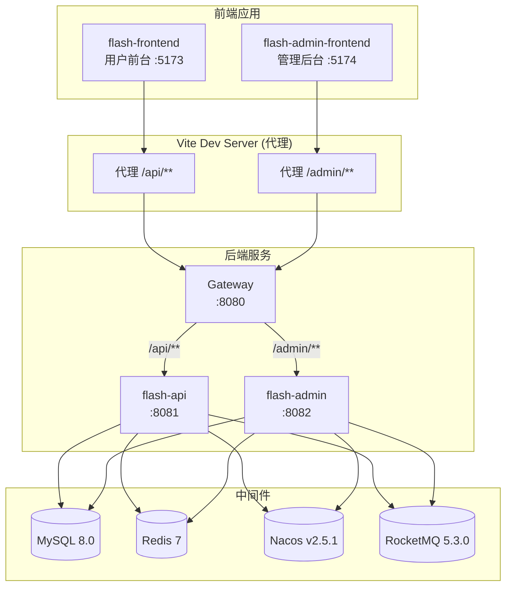
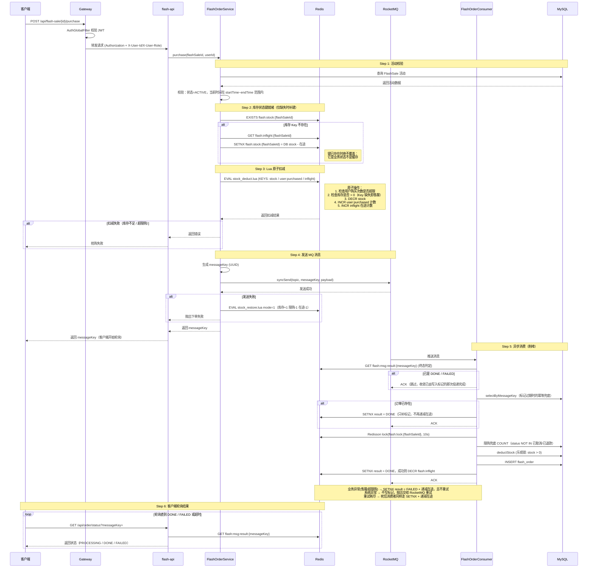

# Flash Sale 系统架构文档

> 本文档面向新入职开发者，帮助你快速理解秒杀系统的整体架构、核心链路和各模块职责。

---

## 1. 系统架构总览


```mermaid
graph TB
    subgraph Frontend["前端应用"]
        UF["flash-frontend<br/>用户前台 :5173"]
        AF["flash-admin-frontend<br/>管理后台 :5174"]
    end

    subgraph ViteProxy["Vite Dev Server (代理)"]
        VP1["代理 /api/**"]
        VP2["代理 /admin/**"]
    end

    subgraph Backend["后端服务"]
        GW["Gateway<br/>:8080"]
        API["flash-api<br/>:8081"]
        ADMIN["flash-admin<br/>:8082"]
    end

    subgraph Middleware["中间件"]
        MySQL[("MySQL 8.0")]
        Redis[("Redis 7")]
        Nacos[("Nacos v2.5.1")]
        MQ[("RocketMQ 5.3.0")]
    end

    UF --> VP1 --> GW
    AF --> VP2 --> GW

    GW -->|"/api/**"| API
    GW -->|"/admin/**"| ADMIN

    API --> MySQL
    API --> Redis
    API --> Nacos
    API --> MQ

    ADMIN --> MySQL
    ADMIN --> Redis
    ADMIN --> Nacos
    ADMIN --> MQ
```

**请求流转路径：** 浏览器 → Vite Dev Server（开发环境代理） → Gateway（统一入口、鉴权、路由转发） → 后端业务服务 → 中间件。

```
**监控数据流：** 应用暴露 `/actuator/prometheus` 端点 → Prometheus 每 15s 拉取（Pull）→ Grafana 连接 Prometheus 查询展示 → Sentinel Dashboard 动态推送流控/熔断规则。

---

## 2. 技术栈

| 分类 | 技术 | 版本 | 说明 |
|------|------|------|------|
| 语言 | Java | 21 | 主开发语言 |
| 框架 | Spring Boot | 3.2.0 | 应用基础框架 |
| 微服务 | Spring Cloud | 2023.0.0 | 微服务基础设施 |
| 微服务 | Spring Cloud Alibaba | 2023.0.1.0 | Nacos 集成 |
| ORM | MyBatis-Plus | 3.5.5 | 数据库访问层 |
| 数据库 | MySQL | 8.0 | 关系型数据库 |
| 缓存 | Redis 7 + Caffeine 3.1.8 + Redisson | 3.24.3 | 缓存 + 分布式锁 |
| 消息队列 | RocketMQ Server | 5.3.0 | 异步削峰 |
| 消息队列 | rocketmq-spring-boot-starter | 2.3.0 | MQ 客户端 |
| 注册中心 | Nacos | v2.5.1 | 服务注册与配置中心 |
| 认证 | jjwt | 0.12.3 | JWT 令牌生成与校验 |
| 前端（用户端） | Vue 3 + Vite | - | 用户前台 SPA |
| 前端（管理端） | Vue 3 + Element Plus | - | 管理后台 SPA |
| 容器化 | Docker | - | 中间件部署 |
| 监控采集 | Prometheus | v2.53.0 | 时序数据库 + 告警引擎（拉模式） |
| 监控可视化 | Grafana | 11.1.0 | 仪表盘可视化（连接 Prometheus 数据源） |
| 熔断降级 | Sentinel | 1.8.8 | 业务层流控/熔断/系统保护（Dashboard 动态推送规则） |
| 节点指标 | Node Exporter | v1.8.1 | 暴露宿主机 CPU/内存/磁盘指标 |

---

## 3. 模块职责

项目采用 Maven 多模块结构，各模块职责如下：

### flash-common（公共基础）

通用工具与基础设施，无业务逻辑。

- `ResultVO` / `ResultCode` — 统一响应封装
- `BaseEntity` — 实体基类（id, createTime, updateTime）
- `JwtUtil` — JWT 令牌工具类
- `PasswordUtil` — BCrypt 密码加密
- `SnowflakeIdGenerator` — 雪花 ID 生成器（自定义 epoch + 时钟回滚保护）
- `RateLimit` — 接口限流注解
- 全局异常与异常处理器
- 常量类：`RedisConstants`、`RocketMQConstants`
- `JacksonConfig` — 注解驱动 Long→String 序列化（解决 JS 雪花 ID 精度丢失）

### flash-model（数据模型）

纯数据定义层，不含任何业务逻辑。

- **实体类**：`User`、`Item`、`FlashSale`、`FlashOrder`
- **DTO**：前端入参映射对象
- **VO**：前端出参视图对象
- **枚举**：`FlashSaleStatusEnum`（PENDING / ACTIVE / ENDED）、`OrderStatusEnum`（PENDING / PAID / CANCELLED）

### flash-mapper（数据访问层）

MyBatis-Plus Mapper 接口。

- `FlashSaleMapper` 包含自定义 SQL：
  - `deductStock` — 乐观扣减库存（`stock = stock - #{quantity} WHERE stock >= #{quantity}`）
  - `restoreStock` — 库存回滚（`stock = stock + #{quantity}`）

### flash-service（业务逻辑层）

核心业务实现，包含服务层、配置类和 MQ 生产者/消费者。

- **配置类**：`RedisConfig`、`CacheConfig`（Caffeine 三级缓存 L1）、`IdGeneratorConfig`（雪花 ID Bean）、`AsyncConfig`（空，已迁至 MQ）
- **DataInitRunner** — 应用启动时初始化数据的钩子
- **FlashOrderProducer** — 秒杀下单消息生产者（syncSend 同步发送）
- **RateLimitInterceptor** — 接口限流拦截器（Redis ZSET 滑动窗口）
- **CaptchaService** — 算术验证码服务（生成 + 校验，Redis 存储，一次性消费）
- **FlashOrderConsumer** — 秒杀下单消息消费者（终态标记 SETNX + DB messageKey 幂等 + Redisson 锁 + 事务扣库存+创建订单；业务终态失败吞没不重试、系统异常 re-throw 交给 MQ 重试，重试耗尽由 FlashOrderDeadLetterConsumer 补写 FAILED）

### flash-api（用户端 API，端口 8081）

面向 C 端用户的 REST 接口。

- `AuthController` — 用户注册、登录、刷新 Token、获取验证码
- `FlashSaleController` — 秒杀活动列表、详情、抢购下单（需验证码）
- `FlashOrderController` — 下单、订单状态轮询、订单列表、支付、取消、退款、删除
- `ItemController` — 商品信息查询
- `CaptchaController` — 生成算术验证码
- `WebMvcConfig` — 注册 RateLimitInterceptor

### flash-admin（管理端 API，端口 8082）

面向运营管理人员的后台 REST 接口。

- `AdminAuthController` — 管理员登录（需验证码）
- 商品 / 秒杀活动 / 订单 / 用户 的 CRUD 管理
- `CaptchaController` — 生成算术验证码
- `WebMvcConfig` — 注册 RateLimitInterceptor
- **定时任务调度器**：`FlashSaleScheduler`、`OrderScheduler`（详见第 5 节）

### flash-gateway（网关，端口 8080）

基于 Spring Cloud Gateway 的统一入口。

- `AuthGlobalFilter` — JWT 鉴权过滤器（白名单放行 + 校验 Token；请求进入网关即**统一剥离**客户端自带的 `X-User-Id`/`X-User-Role` 头，鉴权通过后才按 JWT 中的真实身份**重写**这两个头。该头不是信任边界，鉴权与归属判断仍一律以下游重解析的 Token 为准）
- CORS 跨域配置
- 路由规则：
  - `/api/**` → `flash-api`（lb://flash-api）
  - `/admin/**` → `flash-admin`（lb://flash-admin）
  - `/images/**` → `flash-api`（静态图片资源）

---

## 4. 秒杀下单流程（核心链路）

这是整个系统最关键的业务链路，请重点理解。


```mermaid
sequenceDiagram
    participant C as 客户端
    participant GW as Gateway
    participant API as flash-api
    participant Svc as FlashOrderService
    participant Redis as Redis
    participant MQ as RocketMQ
    participant Consumer as FlashOrderConsumer
    participant DB as MySQL

    C->>GW: POST /api/flash-sale/{id}/purchase
    GW->>GW: AuthGlobalFilter 校验 JWT
    GW->>API: 转发请求 (Authorization + X-User-Id/X-User-Role)
    API->>Svc: purchase(flashSaleId, userId)

    Note over Svc,DB: Step 1: 活动校验
    Svc->>DB: 查询 FlashSale 活动
    DB-->>Svc: 返回活动数据
    Svc->>Svc: 校验：状态=ACTIVE，当前时间在 startTime~endTime 范围内

    Note over Svc,Redis: Step 2: 库存状态键就绪（仅缺失时补建）
    Svc->>Redis: EXISTS flash:stock:{flashSaleId}
    alt 库存 Key 不存在
        Svc->>Redis: GET flash:inflight:{flashSaleId}
        Svc->>Redis: SETNX flash:stock:{flashSaleId} = DB stock - 在途
        Note right of Redis: 键已存在时绝不覆盖：<br/>它是业务状态不是缓存
    end

    Note over Svc,Redis: Step 3: Lua 原子扣减
    Svc->>Redis: EVAL stock_deduct.lua (KEYS: stock / user:purchased / inflight)
    Note right of Redis: 原子操作：<br/>1. 检查用户购买次数是否超限<br/>2. 检查库存是否 > 0（Key 缺失即售罄）<br/>3. DECR stock<br/>4. INCR user:purchased 计数<br/>5. INCR inflight 在途计数
    Redis-->>Svc: 返回扣减结果

    alt 扣减失败（库存不足 / 超限购）
        Svc-->>API: 返回错误
        API-->>C: 抢购失败
    end

    Note over Svc,MQ: Step 4: 发送 MQ 消息
    Svc->>Svc: 生成 messageKey (UUID)
    Svc->>MQ: syncSend(topic, messageKey, payload)
    MQ-->>Svc: 发送成功
    alt 发送失败
        Svc->>Redis: EVAL stock_restore.lua mode=1（库存+1 限购-1 在途-1）
        Svc-->>API: 抛出下单失败
    end

    Svc-->>API: 返回 messageKey
    API-->>C: 返回 messageKey（客户端开始轮询）

    Note over Consumer,DB: Step 5: 异步消费（削峰）
    MQ->>Consumer: 推送消息
    Consumer->>Redis: GET flash:msg:result:{messageKey} (终态判定)
    alt 已是 DONE / FAILED
        Consumer-->>MQ: ACK（跳过，收敛已由写入标记的那次投递完成）
    end
    Consumer->>DB: selectByMessageKey（标记过期时的幂等兜底）
    alt 订单已存在
        Consumer->>Redis: SETNX result = DONE（只补标记，不再递减在途）
        Consumer-->>MQ: ACK
    end
    Consumer->>Redis: Redisson lock(flash:lock:{flashSaleId}, 10s)
    Consumer->>DB: 限购兜底 COUNT（status NOT IN 已取消/已退款）
    Consumer->>DB: deductStock (乐观锁: stock > 0)
    Consumer->>DB: INSERT flash_order
    Consumer->>Redis: SETNX result = DONE，成功则 DECR flash:inflight
    Consumer-->>MQ: ACK
    Note over Consumer,Redis: 业务异常(售罄/超限购) → SETNX result = FAILED + 递减在途，且不重试<br/>系统异常 → 不写标记，抛出交给 RocketMQ 重试<br/>重试耗尽 → 死信消费者同样走 SETNX + 递减在途

    Note over C,Redis: Step 6: 客户端轮询结果
    loop 轮询直到 DONE / FAILED 或超时
        C->>API: GET /api/order/status?messageKey=
        API->>Redis: GET flash:msg:result:{messageKey}
        API-->>C: 返回状态（PROCESSING / DONE / FAILED）
    end
```

**关键设计要点：**

1. **Lua 脚本保证原子性** — 库存扣减、用户购买计数与在途计数在单次 Redis 调用中原子完成，避免竞态条件。
2. **同步发送 + 异步消费** — `syncSend` 确保消息到达 Broker，消费者异步处理实现削峰。
3. **messageKey 轮询机制** — 客户端拿到 messageKey 后轮询 Redis 中的处理状态，实现异步转同步的用户体验。
4. **多重幂等保障** — Redis 终态标记 SETNX（消息级）→ DB messageKey 查询（标记过期后兜底）→ `message_key` UNIQUE 索引（并发级）→ Redisson 分布式锁 + DB 乐观锁（数据级）。
5. **库存键是业务状态，不是缓存** — `flash:stock:{id}` 只由 `FlashStockState` 读写：缺失时按 `DB stock − flash:inflight:{id}` 用 SETNX 补建，已存在时任何路径（含管理端更新、缓存失效）都不得覆盖或删除。**唯一例外是管理端把非活跃场次重新激活**：上一周期的键仍持有旧 DB stock 算出的值，若直接沿用则停售期间调大的库存永不生效，因此激活前先删除旧键，再由 `warmUpRedis` 按新 `DB stock − 在途` 重建（非活跃状态无购买流量，删除是安全的）。在途计数由预扣 Lua `+1`、由终态标记的 SETNX 胜出者 `-1`，保证每笔预扣恰好收敛一次；多减会放出虚假库存（超卖方向），少减只会保守地少卖。

---

## 5. 定时任务

定时任务部署在 **flash-admin** 模块，由管理端统一调度。

### FlashSaleScheduler — 活动状态流转

- **频率**：每 60 秒执行一次
- **PENDING → ACTIVE**：`startTime <= 当前时间` 的活动，更新状态为 ACTIVE，并确保 Redis 库存状态键就绪 —— 键不存在时按 `DB stock − 在途` 用 SETNX 补建，已存在则完全不覆盖
- **ACTIVE → ENDED**：`endTime <= 当前时间` 的活动，更新状态为 ENDED
- ⚠️ 两个 `@Scheduled` 方法均无分布式锁，多实例部署时会重复执行（`OrderScheduler` 的重复归还尤其需要关注）

### OrderScheduler — 超时订单取消

- **频率**：每 5 分钟执行一次
- 查询状态为 PENDING 且创建时间超过 15 分钟的订单
- 将这些订单状态更新为 CANCELLED
- 回滚数据库库存（`restoreStock`）
- 回滚 Redis 状态：单次 `stock_restore.lua` mode=0 调用同时完成库存 +1 与限购计数 −1，且只对已存在的键生效（避免为早已结束的场次建出无 TTL 的脏键）
- 归还脚本的 Redis 异常被 `FlashStockState.apply()` 吞掉，因此上面那个 `@Transactional` 照常提交：
  最坏情况是 DB 已归还、Redis 少归还一次，只会保守地少卖；让异常向外抛反而会把用户的取消动作整体回滚掉

---

## 6. 数据库设计

共 4 张核心表：

| 表名 | 说明 | 关键索引 |
|------|------|----------|
| `user` | 用户表：用户名、密码(BCrypt)、角色 | `username` 唯一索引 — 登录查询 |
| `item` | 商品表：名称、描述、原价、图片 | 无特殊索引，数据量小，全表扫描可接受 |
| `flash_sale` | 秒杀活动表：关联商品、秒杀价、总库存、可用库存、开始/结束时间、状态 | `status` 索引 — 定时任务按状态批量查询；`item_id` 索引 — 按商品查活动 |
| `flash_order` | 秒杀订单表：关联用户和活动、订单号、数量、状态、messageKey | `message_key` 唯一索引 — 幂等校验与轮询查询；`user_id + flash_sale_id` 联合索引 — 用户订单查询；`status + create_time` 联合索引 — 超时订单清理 |

---

## 7. Redis Key 设计

| Key 格式 | 用途 | TTL |
|----------|------|-----|
| `flash:stock:{flashSaleId}` | 秒杀库存计数器（Lua 脚本原子操作，**业务状态非缓存**） | `stockTtlSeconds` = 剩余场次 + 86400s |
| `flash:inflight:{flashSaleId}` | 在途预扣计数：Redis 已扣、DB 未落库的量，DB 重建库存键时的校正依据 | `stockTtlSeconds` = 剩余场次 + 86400s |
| `flash:user:purchased:{flashSaleId}:{userId}` | 用户购买次数计数，防止超限购（DB 另有 `countQuotaOccupied` 兜底） | `stockTtlSeconds` = 剩余场次 + 86400s |
| `flash:sale:{flashSaleId}` | 活动详情缓存，减少 DB 查询 | 3600s ± 300s |
| `flash:lock:{flashSaleId}` | Redisson 分布式锁，保证消费者同一活动串行处理库存 | 锁自动续期（watchdog） |
| `flash:msg:result:{messageKey}` | MQ 消息处理结果标记，值为 DONE/FAILED，仅在业务终态后由 SETNX 写入 | `MSG_RESULT_TTL`（3600s） |
| `rate:limit:{key}:{userId\|ip:xxx}` | 接口限流滑动窗口（ZSET） | window + 1s |
| `captcha:{captchaId}` | 算术验证码答案 | `CAPTCHA_TTL`（300s） |
| `active:list` | 进行中的秒杀活动列表缓存（L2） | `randomTtl(30)` = 30s ± 300s |
| `item:{itemId}` | 商品详情缓存（L2） | `randomTtl(86400)` = 86400s ± 300s |

> 注：`randomTtl()`（±300s 防雪崩）只用于纯缓存键。库存 / 限购 / 在途三个状态键的 TTL 由场次结束时间决定并额外保留 1 天宽限期 ——
> 固定 TTL 会让跨小时的场次在进行中自然过期，之后只能拿滞后的 DB 值重建，从而放出虚假库存。
> `flash:msg:result` 的 3600s 短于状态键生命周期，因此消费者侧仍保留 DB messageKey 幂等查询作为标记过期后的兜底。
> ⚠️ 已知缺陷：`randomTtl()` 的偏移固定为 ±300s，`active:list` 用 `randomTtl(30)` 时负偏移会被钳到 1s，
> 约一半的写入只能得到 1s TTL，等于这一层 L2 缓存在大部分时间不生效。偏移量应按基数的比例取值。

---

## 8. 安全与认证

### JWT 双 Token 机制

- **accessToken**：有效期 30 分钟，每次请求携带，用于身份校验
- **refreshToken**：有效期 7 天，accessToken 过期后用 refreshToken 换取新的 accessToken

### Gateway 鉴权规则（AuthGlobalFilter）

**白名单路径（无需 Token）：**

```
/api/auth/register    — 用户注册
/api/auth/login       — 用户登录
/api/auth/refresh     — 刷新 Token
/admin/auth/login     — 管理员登录
```

**其他所有路径**均需在请求头中携带 `Authorization: Bearer <accessToken>`。

### 身份信息传递

Gateway 校验 Token 通过后，从 JWT payload 中提取 `userId` 和 `role`，重写为 HTTP 请求头（`X-User-Id` / `X-User-Role`）转发给下游。

**⚠️ 该头不是信任边界**：客户端可以自带同名的 `X-User-Id` 请求头，但 `AuthGlobalFilter` 会对**所有**进入网关的请求先统一剥离再重写（放行的公开路径干脆不携带），因此下游看到的这两个头一定由网关写入。即便如此，下游仍不读取该头——每个服务的 `JwtAuthenticationFilter` 都会重新解析 `Authorization` 头中的 Token，以 JWT 中的 `userId` 作为 `Authentication` 的 principal；Controller 通过方法参数 `Authentication`（`auth.getPrincipal()`）获取当前用户。任何涉及归属/越权的判断都必须基于 Token 解析结果，禁止用 `X-User-Id` 请求头取值。

### 验证码机制

登录和秒杀下单需验证码校验（`CaptchaService`）：

- **生成**：随机算术题（a + b / a - b / a × b），答案存入 Redis `captcha:{uuid}`，TTL 300s（`RedisConstants.CAPTCHA_KEY` / `CAPTCHA_TTL`）
- **校验**：比对用户输入与 Redis 中的答案，**无论对错都删除 key**（一次性消费）
- **端点**：`GET /api/auth/captcha`、`GET /admin/auth/captcha`

### 接口限流

基于 `@RateLimit` 注解 + `RateLimitInterceptor` + Redis ZSET 滑动窗口：

| 接口 | 限制 |
|------|------|
| 秒杀下单 | 5 次 / 5 秒 |
| C 端登录 | 5 次 / 60 秒 |
| 注册 | 3 次 / 60 秒 |
| 管理端登录 | 3 次 / 60 秒 |

超限返回 HTTP 429 + `ResultCode.RATE_LIMITED(50007)`。
未认证接口用客户端 IP 限流，已认证接口用 userId 限流。

---

## 9. 消费者隔离机制

### 问题背景

`flash-api` 和 `flash-admin` 两个 Spring Boot 应用的启动类均配置了：

```java
@SpringBootApplication(scanBasePackages = "com.flashsale")
```

这意味着两个应用都会扫描到 `flash-service` 模块中的 `FlashOrderConsumer`，如果不做隔离，将导致：

- **两个应用各创建一个消费者实例**，属于同一个 Consumer Group
- RocketMQ 在同一 Consumer Group 内做负载均衡，消息可能被 `flash-admin` 消费
- `flash-admin` 是管理后台，不应承担订单处理职责，且其环境配置（线程池、连接数等）可能不适合高并发消费

### 解决方案：@ConditionalOnProperty

```java
@Component
@ConditionalOnProperty(name = "flash.flash.consumer.enabled", havingValue = "true")
public class FlashOrderConsumer {
    // ...
}
```

### 配置差异

| 应用 | 配置项 | 值 | 消费者是否创建 |
|------|--------|----|----------------|
| flash-api | `flash.flash.consumer.enabled` | `true` | 是 — 负责消费订单消息 |
| flash-admin | `flash.flash.consumer.enabled` | `false` | 否 — 不创建消费者 Bean |

这样保证了只有 `flash-api` 实例（可水平扩展）消费秒杀订单消息，`flash-admin` 专注于管理功能和定时任务调度，两者职责清晰、互不干扰。

---

## 10. 可观测性（监控栈）

项目采用 **Spring Boot Actuator → Micrometer → Prometheus → Grafana** 标准监控链路，配合 Sentinel Dashboard 实现熔断降级。

### 10.1 监控架构

```
应用（flash-api / flash-admin）
  ↓ 暴露 /actuator/prometheus 端点
Prometheus (:9090) ← 每 15s 拉取（Pull）
  ↓ 存储时序数据
Grafana (:3000) ← 查询 + 可视化大盘

Sentinel Dashboard (:8718) ← 动态推送流控/熔断规则
  ↓ AOP 环绕
FlashOrderServiceImpl.purchase()
```

### 10.2 核心组件

| 组件 | 端口 | 地址 | 职责 |
|------|------|------|------|
| Prometheus | 9090 | http://localhost:9090 | 拉取 + 存储指标，PromQL 查询 |
| Grafana | 3000 | http://localhost:3000（admin/admin） | 可视化大盘，连接 Prometheus 数据源 |
| Sentinel Dashboard | 8718 | http://localhost:8718（sentinel/sentinel） | 动态推送流控/熔断规则，实时监控 |
| Node Exporter | 9100 | — | 暴露宿主机 CPU/内存/磁盘指标 |

### 10.3 启动监控栈

```bash
# 启动全部监控服务
docker compose up -d prometheus grafana node-exporter sentinel-dashboard

# 或和中间件一起启动
docker compose up -d mysql redis nacos rocketmq-namesrv rocketmq-broker prometheus grafana node-exporter sentinel-dashboard
```

### 10.4 关键配置

**application.yml（flash-api / flash-admin 通用）**：

```yaml
management:
  endpoints:
    web:
      exposure:
        include: health,info,prometheus,metrics,env,beans
  metrics:
    tags:
      application: ${spring.application.name}  # 区分 flash-api / flash-admin
    distribution:
      # ★ 关键：暴露 histogram bucket，否则 P99 计算为 "No data"
      percentiles-histogram:
        http.server.requests: true
```

**⚠️ 核心坑**：P99 分位数计算依赖 `_bucket` 指标，Spring Boot 默认只暴露 `_count` / `_sum`。不配置 `percentiles-histogram: true` 会导致 Grafana P99 面板显示 "No data"。

### 10.5 自定义业务指标

`FlashSaleMetrics` 注册三个指标：

| 指标名 | 类型 | 说明 |
|--------|------|------|
| `flashsale.order.success` | Counter | 下单成功次数 |
| `flashsale.order.fail` | Counter | 下单失败次数 |
| `flashsale.order.duration` | Timer | 下单处理耗时（含 SLO 分桶：50ms/100ms/500ms/1s/5s + 百分位直方图） |

埋点在 `FlashOrderController.purchase()` 中调用（Controller 层），用户调一次下单接口就统计一次。

### 10.6 Grafana 看板

Dashboard JSON 通过 **Provisioning 自动加载**（版本控制，重启不丢失）：

```
docker/grafana/
├── provisioning/
│   ├── datasources/prometheus.yml    # 自动注册 Prometheus 数据源
│   └── dashboards/dashboards.yml     # Dashboard Provider 配置
└── dashboards/
    └── flash-sale-overview.json      # 看板定义（JVM / HTTP / 业务指标）
```

看板包含 4 行：Overview（6 个 stat 卡片）→ Business Metrics → HTTP Metrics → JVM & System。

### 10.7 Sentinel 熔断降级

`FlashOrderServiceImpl.purchase()` 标注 `@SentinelResource`：

```java
@SentinelResource(
    value = "flashSale_purchase",
    blockHandler = "purchaseBlock",   // 流控/熔断时调用
    fallback = "purchaseFallback"   // 业务异常时调用
)
```

**与 @RateLimit 的区别**：

| 维度 | @RateLimit | Sentinel |
|------|-----------|----------|
| 作用层 | 控制层（Web MVC Interceptor） | 业务层（AOP 环绕 Service 方法） |
| 实现 | Redis ZSET 滑动窗口 | Sentinel 核心引擎 |
| 用途 | 防刷 / 防撞库 | 流量控制 + 熔断降级 |

**熔断触发验证**：Dashboard 实时监控看熔断状态（CLOSED → OPEN）；触发时请求不走 `purchase()` 方法体，直接进 `purchaseBlock()`。

### 10.8 常见坑

| 现象 | 原因 | 解决 |
|------|------|------|
| Grafana 面板 "No data" | Prometheus Targets DOWN / 指标不存在 / 时间范围不对 | 按顺序排查：targets → graph → actuator → 时间范围 |
| P99 面板 "No data" | 缺少 `_bucket` 指标 | 配 `percentiles-histogram: true` |
| Prometheus 拉不到本地应用 | 容器内 localhost 指向容器自身 | targets 默认已指向 host.docker.internal:8081/8082（宿主机模式）；后端全容器部署时改回容器名 api:8081, admin:8082 |
| Grafana "Failed to upgrade legacy queries" | Dashboard JSON 用旧 `rows` 格式 | 重写为扁平 `panels` 格式 |
| Sentinel 规则重启丢失 | 默认内存存储 | 生产环境接 Nacos 持久化 |

> 详细使用指南见 Obsidian 笔记：`Prometheus 从入门到排查.md`、`Grafana 看板配置实战.md`、`Sentinel Dashboard 使用指南.md`。
