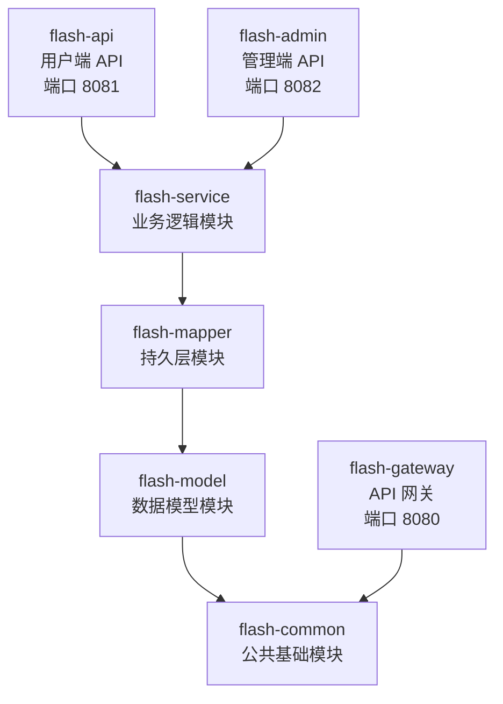

# Flash Sale 秒杀系统 - 开发指南

本文档帮助新加入的开发者快速理解项目结构、技术选型和开发规范，并尽快进入开发状态。

---

## 1. 项目模块依赖关系

本项目采用 Maven 多模块结构，基于 Spring Boot 3.2 + Spring Cloud 2023 + Spring Cloud Alibaba 构建。各模块之间的依赖关系如下：


```mermaid
graph TD
    flash-common[flash-common<br/>公共基础模块]
    flash-model[flash-model<br/>数据模型模块]
    flash-mapper[flash-mapper<br/>持久层模块]
    flash-service[flash-service<br/>业务逻辑模块]
    flash-api[flash-api<br/>用户端 API<br/>端口 8081]
    flash-admin[flash-admin<br/>管理端 API<br/>端口 8082]
    flash-gateway[flash-gateway<br/>API 网关<br/>端口 8080]

    flash-model --> flash-common
    flash-mapper --> flash-model
    flash-service --> flash-mapper
    flash-api --> flash-service
    flash-admin --> flash-service
    flash-gateway --> flash-common
```

**依赖说明：**

| 模块 | 依赖 | 说明 |
|------|------|------|
| flash-common | 无 | 公共工具类、异常处理、统一返回、常量定义 |
| flash-model | flash-common | 实体类、DTO、VO、枚举 |
| flash-mapper | flash-model | MyBatis-Plus Mapper 接口 |
| flash-service | flash-mapper | 业务逻辑实现、Redis/MQ 配置、消息生产与消费 |
| flash-api | flash-service | 用户端 REST 控制器，同时承载 MQ 消费者 |
| flash-admin | flash-service | 管理端 REST 控制器、定时任务调度器 |
| flash-gateway | flash-common | 仅依赖 JwtUtil 做 Token 校验，不依赖业务层 |

**端口分配：**

| 服务 | 端口 |
|------|------|
| flash-gateway | 8080 |
| flash-api | 8081 |
| flash-admin | 8082 |
| flash-frontend（用户前端） | 5173 |
| flash-admin-frontend（管理前端） | 5174 |

**中间件依赖：**

| 中间件 | 用途 | 配置地址 |
|--------|------|----------|
| MySQL 8.0 | 持久化存储 | 127.0.0.1:3306，数据库 `flash_sale` |
| Redis | 库存预扣、缓存、分布式锁、幂等校验 | 127.0.0.1:6379 |
| RocketMQ | 异步下单消息队列 | 127.0.0.1:9876 |
| Nacos | 服务注册与发现 | 127.0.0.1:8848 |

---

## 2. 包结构规范

```
com.flashsale
├── common                          # flash-common 模块
│   ├── result                      # 统一返回结果
│   │   ├── ResultVO                # 统一返回包装类
│   │   └── ResultCode              # 错误码枚举
│   ├── exception                   # 自定义异常
│   │   ├── BusinessException       # 业务异常
│   │   ├── UnauthorizedException   # 未授权异常
│   │   └── ForbiddenException      # 禁止访问异常
│   ├── handler
│   │   └── GlobalExceptionHandler  # 全局异常处理器
│   ├── util                        # 工具类
│   │   ├── JwtUtil                 # JWT 令牌工具
│   │   ├── PasswordUtil            # 密码加密工具
│   │   └── SnowflakeIdGenerator    # 雪花 ID 生成器（自定义 epoch + 时钟回滚保护）
│   ├── config
│   │   ├── MyMetaObjectHandler     # MyBatis-Plus 自动填充处理器
│   │   └── JacksonConfig           # Jackson JSON 序列化配置（Long→String 解决 JS 精度丢失）
│   ├── constant                    # 常量定义
│   │   ├── RedisConstants          # Redis Key、TTL 常量与缓存防护工具方法
│   │   └── RocketMQConstants       # RocketMQ Topic/Tag/Group 常量
│   ├── annotation
│   │   └── RateLimit               # 接口限流注解
│   └── enums
│       └── StatusEnum              # 通用状态枚举
│
├── model                           # flash-model 模块
│   ├── entity                      # 数据库实体
│   │   ├── User                    # 用户
│   │   ├── Item                    # 商品
│   │   ├── FlashSale               # 秒杀活动
│   │   └── FlashOrder              # 秒杀订单
│   ├── dto                         # 请求数据传输对象
│   │   ├── LoginDTO                # 登录请求
│   │   └── RegisterDTO             # 注册请求
│   ├── vo                          # 返回视图对象
│   │   ├── LoginVO                 # 登录返回（含 Token）
│   │   ├── UserVO                  # 用户信息
│   │   ├── ItemVO                  # 商品信息
│   │   ├── FlashSaleVO             # 秒杀活动详情（含商品信息）
│   │   ├── FlashOrderVO            # 秒杀订单（含 messageKey）
│   │   └── PageVO                  # 分页封装
│   └── enums                       # 业务枚举
│       ├── FlashSaleStatusEnum     # 秒杀活动状态
│       ├── OrderStatusEnum         # 订单状态
│       └── UserRoleEnum            # 用户角色
│
├── mapper                          # flash-mapper 模块
│   ├── UserMapper                  # 用户 Mapper
│   ├── ItemMapper                  # 商品 Mapper
│   ├── FlashOrderMapper            # 订单 Mapper
│   └── FlashSaleMapper             # 秒杀活动 Mapper
│
├── service                         # flash-service 模块
│   ├── UserService / ItemService / FlashSaleService / FlashOrderService
│   ├── impl                        # Service 实现类
│   │   ├── UserServiceImpl
│   │   ├── ItemServiceImpl
│   │   ├── FlashSaleServiceImpl
│   │   └── FlashOrderServiceImpl
│   ├── config                      # 配置类
│   │   ├── RedisConfig             # RedisTemplate + Lua 脚本加载
│   │   ├── CacheConfig             # Caffeine 三级缓存（L1）
│   │   ├── IdGeneratorConfig       # 雪花 ID Spring Bean
│   │   ├── MyBatisPlusConfig       # 分页插件配置
│   │   ├── AsyncConfig             # 空配置（秒杀已迁至 RocketMQ）
│   │   └── DataInitRunner          # 启动数据初始化
│   ├── filter
│   │   └── JwtAuthenticationFilter # Spring Security JWT 过滤器
│   ├── interceptor
│   │   └── RateLimitInterceptor    # 接口限流拦截器（Redis 滑动窗口）
│   ├── producer
│   │   └── FlashOrderProducer      # RocketMQ 消息生产者
│   ├── consumer
│   │   └── FlashOrderConsumer      # RocketMQ 消息消费者（仅 flash-api 启用）
│   └── message
│       └── FlashOrderMessage       # MQ 消息体定义
│
├── api                             # flash-api 模块
│   ├── controller
│   │   ├── AuthController          # /api/auth/**（注册、登录、刷新 Token、验证码）
│   │   ├── CaptchaController       # /api/auth/captcha（生成算术验证码）
│   │   ├── ItemController          # /api/item/**（商品列表、详情）
│   │   ├── FlashSaleController     # /api/flash-sale/**（活动列表、详情）
│   │   └── FlashOrderController    # /api/order/**（下单、支付、取消、退款、删除、状态轮询）
│   └── config
│       ├── ApiSecurityConfig       # C 端 Spring Security 配置
│       └── WebMvcConfig            # 注册 RateLimitInterceptor
│
├── admin                           # flash-admin 模块
│   ├── controller
│   │   ├── AuthController          # /admin/auth/**（管理员登录，需验证码）
│   │   ├── CaptchaController       # /admin/auth/captcha（生成算术验证码）
│   │   ├── ItemController          # /admin/item/**（商品 CRUD）
│   │   ├── FlashSaleController     # /admin/flash-sale/**（活动 CRUD + 状态变更）
│   │   ├── OrderController         # /admin/order/**（订单查看、支付、退款、删除）
│   │   └── UserController          # /admin/user/**（用户管理，分页）
│   ├── config
│   │   ├── AdminSecurityConfig     # B 端 Spring Security 配置（仅 ADMIN 角色）
│   │   └── WebMvcConfig            # 注册 RateLimitInterceptor
│   └── scheduler
│       ├── FlashSaleScheduler      # 秒杀活动状态自动流转（每分钟）
│       └── OrderScheduler          # 超时未支付订单自动取消（每 5 分钟）
│
└── gateway                         # flash-gateway 模块
    ├── GatewayApplication          # 网关启动类
    ├── filter
    │   └── AuthGlobalFilter        # JWT 全局鉴权过滤器
    └── config
        └── CorsConfig              # 跨域配置
```

---

## 3. API 接口文档

### 3.1 用户端 API

通过 Gateway（端口 8080）按路径 `/api/**` 转发到 flash-api（端口 8081）。

| Method | Path | 说明 | 需要认证 |
|--------|------|------|----------|
| POST | `/api/auth/register` | 用户注册 | 否 |
| POST | `/api/auth/login` | 用户登录（需验证码），返回 accessToken 和 refreshToken | 否 |
| POST | `/api/auth/refresh?refreshToken=` | 刷新 Token | 否 |
| GET | `/api/auth/captcha` | 获取算术验证码（返回 captchaId + 表达式） | 否 |
| GET | `/api/item/list?page=1&size=10` | 商品列表（分页） | 是 |
| GET | `/api/item/{id}` | 商品详情 | 是 |
| GET | `/api/flash-sale/active` | 当前进行中的秒杀活动列表 | 是 |
| GET | `/api/flash-sale/{id}` | 秒杀活动详情（含关联商品信息） | 是 |
| POST | `/api/flash-sale/{id}/purchase` | 秒杀下单（需验证码），返回 messageKey | 是 |
| GET | `/api/order/status?messageKey=` | 轮询订单异步处理状态（PROCESSING / DONE / FAILED） | 是 |
| GET | `/api/order/list?page=1&size=10&status=&keyword=` | 我的订单列表（分页，支持状态筛选与订单号/商品名称搜索） | 是 |
| GET | `/api/order/{id}` | 订单详情 | 是 |
| POST | `/api/order/{id}/pay` | 支付订单 | 是 |
| POST | `/api/order/{id}/cancel` | 取消订单 | 是 |
| POST | `/api/order/{id}/refund` | 退款 | 是 |
| DELETE | `/api/order/{id}` | 删除已取消订单 | 是 |

**秒杀下单流程：**

1. 客户端调用 `POST /api/flash-sale/{id}/purchase`
2. 服务端确保 Redis 库存状态键就绪（缺失时按 `DB stock − 在途` 用 SETNX 补建，已存在完全不覆盖），
   再执行 Redis Lua 脚本进行库存预扣和限购校验
3. 预扣成功后，通过 RocketMQ 发送异步下单消息
4. 立即返回 `messageKey` 给客户端
5. 客户端使用 `messageKey` 轮询 `GET /api/order/status` 获取订单创建结果
6. 消费者异步处理：幂等校验 -> 分布式锁 -> 限购 DB 兜底 -> DB 乐观锁扣库存 -> 创建订单
   -> 写终态标记并收敛在途计数

### 3.2 管理端 API

通过 Gateway（端口 8080）按路径 `/admin/**` 转发到 flash-admin（端口 8082）。

| Method | Path | 说明 |
|--------|------|------|
| POST | `/admin/auth/login` | 管理员登录（需验证码，校验 role=ADMIN） |
| GET | `/admin/auth/captcha` | 获取算术验证码 |
| GET | `/admin/item/list?page=1&size=10` | 商品列表（分页） |
| GET | `/admin/item/{id}` | 商品详情 |
| POST | `/admin/item` | 创建商品 |
| PUT | `/admin/item` | 更新商品（请求体中包含 id） |
| DELETE | `/admin/item/{id}` | 删除商品（逻辑删除） |
| GET | `/admin/flash-sale/list?page=1&size=10&status=` | 秒杀活动列表（分页，可按状态筛选） |
| GET | `/admin/flash-sale/{id}` | 秒杀活动详情 |
| POST | `/admin/flash-sale` | 创建秒杀活动 |
| PUT | `/admin/flash-sale` | 更新秒杀活动（请求体中包含 id） |
| DELETE | `/admin/flash-sale/{id}` | 删除秒杀活动（逻辑删除） |
| PUT | `/admin/flash-sale/{id}/status` | 变更活动状态（含 Redis 缓存预热） |
| GET | `/admin/order/list?page=1&size=10` | 订单列表（分页） |
| GET | `/admin/order/{id}` | 订单详情 |
| POST | `/admin/order/{id}/pay` | 确认支付 |
| POST | `/admin/order/{id}/refund` | 退款 |
| DELETE | `/admin/order/{id}` | 删除已取消订单 |
| GET | `/admin/user/list?page=1&size=10` | 用户列表 |
| PUT | `/admin/user/{id}/status` | 启用/禁用用户 |

> ⚠️ `PUT /admin/flash-sale` 对**进行中（ACTIVE）**的活动拒绝修改 `stock`，返回 `BAD_REQUEST`。
> 该列既是总量也是台账，而后台表单提交的是打开页面那一刻的快照值，全量 `updateById` 会把它写回旧值或更大值，
> 等于凭空放出已卖出的库存。需要补库存时走「结束活动 → 改库存 → 重新激活」——
> 重新激活时服务端会先删除上一周期遗留的旧库存键，再按新 `DB stock − 在途` 重建
> （键已存在时 `ensureStockKey` 会跳过重建，不先删键则补货永不生效）。其他字段在进行中可正常修改。
> admin 前端在活动进行中会把「库存」输入置灰并从提交体里剥离该字段，避免旧快照值误触发拦截。

### 3.3 认证机制

**Gateway 层鉴权（`AuthGlobalFilter`）：**

- 以下路径跳过鉴权：`/api/auth/register`、`/api/auth/login`、`/api/auth/refresh`、`/admin/auth/login`
- 其他路径必须在 `Authorization` 请求头中携带 `Bearer {token}`
- 请求进入网关即统一剥离客户端自带的 `X-User-Id`/`X-User-Role` 请求头，Token 校验通过后再按 JWT 中的身份重写这两个头（仅辅助信息，非信任边界，见下方说明）

**Service 层认证（`JwtAuthenticationFilter`）：**

- 基于 Spring Security 的认证过滤器，重新解析 `Authorization` 头中的 Token，构建 `Authentication` 对象（principal = JWT 中的 `userId`）
- Controller 通过方法参数 `Authentication`（`auth.getPrincipal()`）获取当前用户，**不从 `X-User-Id` 请求头取值**——该头可被客户端伪造，不是信任边界

**JWT 配置：**

| 参数 | 值 | 说明 |
|------|-----|------|
| jwt.secret | 256 位密钥 | HS256 签名密钥 |
| jwt.expiration | 1800000 ms | accessToken 有效期 30 分钟 |
| jwt.refresh-expiration | 604800000 ms | refreshToken 有效期 7 天 |

---

## 4. 统一返回格式

所有接口统一使用 `ResultVO<T>` 作为返回类型：

```json
{
  "code": 200,
  "msg": "success",
  "data": { ... }
}
```

**使用方式：**

```java
// 成功返回数据
ResultVO.success(data);

// 成功无数据
ResultVO.success();

// 失败返回
ResultVO.fail(ResultCode.BAD_REQUEST);
ResultVO.fail(ResultCode.BAD_REQUEST, "自定义错误信息");
```

**错误码定义（`ResultCode.java`）：**

| Code | 常量名 | 说明 |
|------|--------|------|
| 200 | SUCCESS | 请求成功 |
| 400 | BAD_REQUEST | 请求参数错误 |
| 401 | UNAUTHORIZED | 未认证或 Token 过期 |
| 403 | FORBIDDEN | 无权限访问 |
| 404 | NOT_FOUND | 资源不存在 |
| 500 | SYSTEM_ERROR | 系统内部错误 |
| 50001 | FLASH_SOLD_OUT | 已售罄 |
| 50002 | FLASH_REPEAT | 重复购买（超过限购次数） |
| 50003 | FLASH_NOT_STARTED | 秒杀活动未开始 |
| 50004 | FLASH_ENDED | 秒杀活动已结束 |
| 50005 | STOCK_NOT_ENOUGH | 库存不足 |
| 50006 | CAPTCHA_ERROR | 验证码错误 |
| 50007 | RATE_LIMITED | 请求过于频繁 |

---

## 5. 枚举值说明

### FlashSaleStatusEnum（秒杀活动状态）

定义在 `com.flashsale.model.enums.FlashSaleStatusEnum`。

| 枚举值 | Code | 说明 | 触发方式 |
|--------|------|------|----------|
| PENDING | 0 | 待开始 | 创建活动时默认状态 |
| ACTIVE | 1 | 进行中 | 定时任务 `FlashSaleScheduler` 自动流转，或管理员手动变更；触发 Redis 缓存预热 |
| ENDED | 2 | 已结束 | 定时任务 `FlashSaleScheduler` 自动流转，或管理员手动变更 |
| CANCELLED | 3 | 已取消 | 管理员手动变更 |

**状态流转规则：**

```
PENDING(0) ──→ ACTIVE(1) ──→ ENDED(2)
     │              │
     └──────→ CANCELLED(3) ←──┘
```

### OrderStatusEnum（订单状态）

定义在 `com.flashsale.model.enums.OrderStatusEnum`。

| 枚举值 | Code | 说明 | 触发方式 |
|--------|------|------|----------|
| PENDING_PAYMENT | 0 | 待支付 | 消费者创建订单时默认状态 |
| PAID | 1 | 已支付 | 用户主动支付或管理员确认支付 |
| CANCELLED | 2 | 已取消 | 用户主动取消，或 `OrderScheduler` 超时自动取消（15 分钟未支付） |
| REFUNDED | 3 | 已退款 | 管理员操作退款 |

**状态流转规则：**

```
PENDING_PAYMENT(0) ──→ PAID(1) ──→ REFUNDED(3)
       │
       └──────→ CANCELLED(2)
```

### UserRoleEnum（用户角色）

| 枚举值 | 说明 |
|--------|------|
| USER | 普通用户 |
| ADMIN | 管理员 |

---

## 6. Redis Lua 脚本

### 库存预扣脚本（`stock_deduct.lua`）

位于 `flash-service/src/main/resources/scripts/stock_deduct.lua`，在 Redis 服务端单线程执行，保证原子性。

**参数说明：**

| 参数 | 含义 | 取值 |
|------|------|------|
| KEYS[1] | 库存 Key | `flash:stock:{flashSaleId}` |
| KEYS[2] | 用户已购计数 Key | `flash:user:purchased:{flashSaleId}:{userId}` |
| KEYS[3] | 在途预扣计数 Key | `flash:inflight:{flashSaleId}` |
| ARGV[1] | 每人限购数量 | `flash_sale.limit_per_user` |
| ARGV[2] | 已购计数 TTL（秒） | `RedisConstants.stockTtlSeconds(endTime)` |
| ARGV[3] | 在途计数 TTL（秒） | `RedisConstants.stockTtlSeconds(endTime)` |

**返回值：**

| 返回值 | 含义 |
|--------|------|
| `1` | 购买成功：库存 -1，用户计数 +1，在途计数 +1 |
| `0` | 超过用户限购次数 |
| `-1` | 库存不足（已售罄）**或库存 Key 不存在** |

**执行逻辑：**

```lua
-- 1. 检查用户是否已超过限购次数
local purchased = tonumber(redis.call('GET', KEYS[2]) or '0')
if purchased >= tonumber(ARGV[1]) then
    return 0
end

-- 2. 检查库存是否充足（Key 缺失按售罄处理，禁止在此脚本内回源 DB）
local stock = tonumber(redis.call('GET', KEYS[1]) or '-1')
if stock <= 0 then
    return -1
end

-- 3. 原子操作：扣库存 + 记录用户购买 + 累加在途预扣
redis.call('DECR', KEYS[1])

-- TTL 只在首次购买时设置：每次重设会让计数键随购买滑动
local count = redis.call('INCR', KEYS[2])
if count == 1 then
    redis.call('EXPIRE', KEYS[2], ARGV[2])
end

-- 在途 = 已从 Redis 预扣但 DB 尚未落库的量，是 DB 重建库存的校正依据
local inflight = redis.call('INCR', KEYS[3])
if inflight == 1 then
    redis.call('EXPIRE', KEYS[3], ARGV[3])
end

return 1
```

> 库存 Key 缺失时脚本直接返回 `-1` 而不回源 DB：回源逻辑留在 Java 侧的
> `FlashStockState.ensureStockKey()`，它按 `DB stock − 在途` 用 `SETNX` 补建，键已存在时完全不覆盖。

### 库存归还脚本（`stock_restore.lua`）

与预扣反向，同一个脚本按 `ARGV[1]` 的 mode 区分三种语义：

| mode | 场景 | 库存 | 已购计数 | 在途计数 |
|------|------|------|----------|----------|
| `1` | MQ 发送失败，回滚本次预扣 | +1 | -1 | -1 |
| `0` | 超时取消 / 退款，归还已落库订单 | +1 | -1 | 不变 |
| `2` | 消费者到达业务终态，只收敛在途计数 | 不变 | 不变 | -1 |

**关键约束：只对「已存在」的 Key 生效。** 裸 `INCR`/`DECR` 会为早已结束的场次建出无 TTL 的脏键，
库存键还会被凭空 +1，下一次场次误读到这个脏值。返回值为实际改动的键数量，`0` 表示本场状态键已全部过期。

### MQ 发送失败必须回滚 Redis

Lua 预扣成功后 Redis 状态已变更（库存 -1、已购 +1、在途 +1），如果后续 RocketMQ 同步发送失败，
**必须回滚**，否则这部分库存既落不到 DB 也回不到 Redis：

- **回滚实现**：`FlashOrderServiceImpl` 捕获发送异常后调用 `FlashStockState.rollbackReservation()`，
  即 `EVAL stock_restore.lua mode=1`，三个键的增减在 Redis 服务端一次完成
- **回滚失败只记日志**：`FlashStockState.apply()` 吞掉 Redis 异常。此时在途计数会残留偏高，
  下一次库存重建因此少放库存 —— 偏高的代价是少卖，可接受；反向（凭空放出库存）不可接受。
  同一策略也用于取消 / 退款的归还：归还失败不回滚外层 `@Transactional` 的 DB 落库，
  避免一次 Redis 抖动把用户已成功的取消操作一起撤掉
- **关键原则**：Redis 预扣是"乐观"操作，MQ 发送失败时不能假设 Redis 状态一定正确

### Redis Key 规范

| Key 模式 | 说明 | 来源 |
|----------|------|------|
| `flash:stock:{flashSaleId}` | 秒杀库存余量（业务状态，非缓存） | `RedisConstants.FLASH_STOCK_KEY` |
| `flash:inflight:{flashSaleId}` | 在途预扣计数：Redis 已扣、DB 未落库的量 | `RedisConstants.FLASH_INFLIGHT_KEY` |
| `flash:sale:{flashSaleId}` | 秒杀活动详情缓存 | `RedisConstants.FLASH_SALE_KEY` |
| `flash:user:purchased:{flashSaleId}:{userId}` | 用户已购数量 | `RedisConstants.FLASH_USER_PURCHASED_KEY` |
| `flash:lock:{flashSaleId}` | Redisson 分布式锁 | `RedisConstants.FLASH_LOCK_KEY` |
| `flash:msg:result:{messageKey}` | MQ 消息处理结果（DONE/FAILED，仅业务终态后由 SETNX 写入） | `RocketMQConstants.MSG_RESULT_KEY` |
| `rate:limit:{key}:{userId\|ip:xxx}` | 接口限流滑动窗口（ZSET） | `RateLimitInterceptor` |
| `captcha:{captchaId}` | 算术验证码答案 | `RedisConstants.CAPTCHA_KEY` |
| `active:list` | 进行中的秒杀活动列表缓存（L2） | `RedisConstants.ACTIVE_FLASH_SALE_LIST_KEY` |
| `item:{itemId}` | 商品详情缓存（L2） | `RedisConstants.ITEM_CACHE_KEY` |

> 注：`randomTtl()`（±300s 随机偏移，防雪崩）只用于纯缓存键。
> 库存 / 已购 / 在途三个状态键的 TTL 由 `RedisConstants.stockTtlSeconds(endTime)` 决定
> （剩余场次时间 + 1 天宽限期），用固定 TTL 会让跨小时的场次在进行中自然过期。

---

## 7. RocketMQ 消息机制

### 基本配置

| 配置项 | 值 | 来源 |
|--------|-----|------|
| Topic | `flash-order-topic` | `RocketMQConstants.FLASH_ORDER_TOPIC` |
| Tag | `create` | `RocketMQConstants.TAG_CREATE` |
| Consumer Group | `flash-order-consumer-group` | `RocketMQConstants.ORDER_CONSUMER_GROUP` |
| Producer Group（API） | `flash-api-producer-group` | application.yml |
| Producer Group（Admin） | `flash-admin-producer-group` | application.yml |

### 消息体（`FlashOrderMessage`）

```java
public class FlashOrderMessage implements Serializable {
    private String messageKey;     // 消息唯一键：flashSaleId_userId_timestamp
    private Long flashSaleId;      // 秒杀活动 ID
    private Long userId;           // 用户 ID
    private Long itemId;           // 商品 ID
    private BigDecimal flashPrice; // 秒杀价格
}
```

### 消费者处理流程（`FlashOrderConsumer`）

```
收到消息
  │
  ├── 1. 终态判定：GET flash:msg:result:{messageKey}
  │      └── 已是 DONE / FAILED → 跳过（标记只在业务终态后写入，不会短路重试）
  │
  ├── 2. DB 幂等校验：FlashOrderMapper.selectByMessageKey()
  │      └── 已存在 → markSettledOnly(DONE)：只补标记，不递减在途
  │                  （订单由更早一次投递落库，那笔预扣已在那次收敛）
  │
  ├── 3. Redisson 分布式锁：flash:lock:{flashSaleId}（最长持有 10 秒）
  │
  ├── 4. 事务扣库存+创建订单：FlashOrderServiceImpl.deductStockAndCreateOrder()
  │      └── @Transactional：
  │           ├─ messageKey 幂等复查 → 命中返回 null（调用方不递减在途）
  │           ├─ checkPurchaseLimit：countQuotaOccupied 限购 DB 兜底
  │           │    （Redis 限购键会过期/丢失，缺一层就无声变成「不限购」；
  │           │     同一场次已被步骤 3 串行化，普通 COUNT 即可，无需 FOR UPDATE）
  │           ├─ 乐观锁 deductStock（stock > 0 才更新，返回 0 抛 FLASH_SOLD_OUT）
  │           └─ INSERT order（失败则 deductStock 一并回滚）
  │
  └── 异常处理（终态标记与在途计数统一交给 FlashOrderSettler）：
         ├── 本次真正落库 → settleAndRelease(DONE)：SETNX 成功才 DECR 在途
         ├── BusinessException（售罄/超限购/活动结束）→ settleAndRelease(FAILED)，吞没不重试
         ├── 其他 Exception → 不写标记，re-throw 触发 RocketMQ 重试
         └── 重试耗尽进死信 → FlashOrderDeadLetterConsumer.settleAndRelease(FAILED)
```

> **在途收敛不变式**：一笔预扣的在途计数恰好递减一次，且当且仅当某次投递真正写入了终态标记。
> `FlashOrderSettler` 用 `setIfAbsent` 的返回值同时充当「这次投递是否负责收敛」的判据，
> 因此主消费者与死信消费者重复处理同一条消息不会多减。
> 误差方向是单向可接受的：多减会放出虚假库存（超卖方向），少减只会少卖。

### 消费者启用控制

消费者仅在 flash-api 模块中启用，通过配置项控制：

```yaml
# flash-api application.yml
flash:
  flash:
    consumer:
      enabled: true    # 启用消费者

# flash-admin application.yml
flash:
  flash:
    consumer:
      enabled: false   # 禁用消费者，避免同组竞争消费
```

实现方式：`@ConditionalOnProperty(name = "flash.flash.consumer.enabled", havingValue = "true")`

### 常见踩坑

**坑1：`consumeFromWhere` 默认值**

`rocketmq-spring-boot-starter 2.3.0` 默认 `CONSUME_FROM_LAST_OFFSET`。消费者启动后只接收**启动后**到达的新消息，历史消息静默跳过且不报错。开发调试阶段容易漏消息。

如需消费历史消息，通过 `BeanPostProcessor` 修改：

```java
@Component
public class RocketMQListenerCustomizer implements BeanPostProcessor {
    @Override
    public Object postProcessAfterInitialization(Object bean, String beanName) {
        if (bean instanceof DefaultMQPushConsumer consumer) {
            consumer.setConsumeFromWhere(ConsumeFromWhere.CONSUME_FROM_FIRST_OFFSET);
        }
        return bean;
    }
}
```

> 生产环境推荐保持 `CONSUME_FROM_LAST_OFFSET`，配合 offset 持久化。`CONSUME_FROM_FIRST_OFFSET` 仅适合开发调试。

**坑2：Broker 就绪时序**

Consumer 在 Broker 完全就绪前启动，可能**不报错但实际未订阅成功**。Broker 日志出现 `boot success` 后再启动应用，否则消息可能静默丢失。

---

## 8. 前端开发

### 8.1 技术栈

| 项 | 技术 |
|----|------|
| 框架 | Vue 3 |
| 构建工具 | Vite |
| HTTP 客户端 | Axios |
| 路由 | Vue Router |

### 8.2 代理配置

**用户前端（flash-frontend，端口 5173）：**

```javascript
// vite.config.js
proxy: {
  '/api':  { target: 'http://localhost:8080', changeOrigin: true },
  '/admin': { target: 'http://localhost:8080', changeOrigin: true }
}
```

**管理前端（flash-admin-frontend，端口 5174）：**

```javascript
// vite.config.js
proxy: {
  '/admin': { target: 'http://localhost:8080', changeOrigin: true }
}
```

所有前端请求先到达 Vite 开发服务器，再由代理转发到 Gateway（8080），Gateway 根据路径转发到对应的后端服务。

### 8.3 认证流程

```
1. 用户登录 → 获取 accessToken + refreshToken
2. 将 accessToken 存入 localStorage（key: 'accessToken'）
3. Axios 请求拦截器自动添加 Authorization: Bearer {token} 请求头
4. 收到 401 响应时，清除 Token 并跳转到登录页
```

**用户前端 Token Key：** `accessToken`、`refreshToken`
**管理前端 Token Key：** `adminToken`

### 8.4 页面路由

**用户前端（flash-frontend）：**

| Path | 组件 | 说明 | 需要认证 |
|------|------|------|----------|
| `/` | Home.vue | 首页（商品列表、秒杀活动列表） | 是 |
| `/login` | Login.vue | 登录页 | 否 |
| `/register` | Register.vue | 注册页 | 否 |
| `/flash-sale/:id` | FlashSaleDetail.vue | 秒杀活动详情与下单 | 是 |
| `/orders` | OrderList.vue | 我的订单列表 | 是 |

**管理前端（flash-admin-frontend）：**

| Path | 组件 | 说明 | 需要认证 |
|------|------|------|----------|
| `/login` | Login.vue | 管理员登录页 | 否 |
| `/` | Dashboard.vue | 仪表盘（布局容器，默认重定向到 /items） | 是 |
| `/items` | ItemList.vue | 商品管理 | 是 |
| `/flash-sales` | FlashSaleList.vue | 秒杀活动管理 | 是 |
| `/orders` | OrderList.vue | 订单管理 | 是 |
| `/users` | UserList.vue | 用户管理 | 是 |

管理前端使用嵌套路由，`Dashboard.vue` 作为父级布局容器，包含侧边栏导航和 `<router-view>` 插槽。

---

## 9. 代码规范

### 9.1 命名规范

| 类别 | 规范 | 示例 |
|------|------|------|
| 类名 | 大驼峰（PascalCase） | `FlashSaleService`、`OrderStatusEnum` |
| 方法名 | 小驼峰（camelCase） | `getActiveFlashSales()`、`cancelOrder()` |
| 变量名 | 小驼峰（camelCase） | `flashSaleId`、`orderStatus` |
| 常量 | 大写下划线 | `FLASH_STOCK_KEY`、`ORDER_TIMEOUT_MINUTES` |
| 数据库字段 | 小写下划线（snake_case） | `user_id`、`flash_price`、`create_time` |
| 包名 | 全小写 | `com.flashsale.service.impl` |

### 9.2 统一返回

- 所有 Controller 方法统一返回 `ResultVO<T>`，禁止直接返回裸数据
- 使用 `ResultVO.success(data)` 返回成功响应
- 使用 `ResultVO.fail(ResultCode.XXX)` 返回失败响应
- 错误码统一在 `ResultCode` 枚举中维护，不要硬编码数字

### 9.3 异常处理

- 业务异常统一抛出 `BusinessException`，由 `GlobalExceptionHandler` 捕获并转换为 `ResultVO`
- 认证异常使用 `UnauthorizedException`
- 权限异常使用 `ForbiddenException`
- Controller 层不做 try-catch，异常由全局处理器统一处理

### 9.4 数据库规范

- 所有表必须包含以下基础字段：`id`（主键）、`create_time`、`update_time`、`is_deleted`
- 逻辑删除字段 `is_deleted`：0 表示正常，1 表示已删除
- 由 MyBatis-Plus 的 `MyMetaObjectHandler` 自动填充 `create_time` 和 `update_time`
- 禁止使用 `SELECT *`，查询时必须指定具体字段
- 使用 MyBatis-Plus 提供的逻辑删除功能，删除操作实际执行 UPDATE

### 9.5 建表规范

参考 `sql/init.sql`，所有表遵循以下规范：

```sql
-- 基础字段
`id` BIGINT AUTO_INCREMENT PRIMARY KEY,
`create_time` DATETIME NOT NULL DEFAULT CURRENT_TIMESTAMP,
`update_time` DATETIME NOT NULL DEFAULT CURRENT_TIMESTAMP ON UPDATE CURRENT_TIMESTAMP,
`is_deleted` TINYINT NOT NULL DEFAULT 0 COMMENT '0=正常 1=已删除'

-- 字符集
ENGINE=InnoDB DEFAULT CHARSET=utf8mb4 COLLATE=utf8mb4_unicode_ci
```

### 9.6 定时任务说明

| 任务 | 位置 | 频率 | 说明 |
|------|------|------|------|
| `FlashSaleScheduler` | flash-admin | 每 60 秒 | 自动将到达开始时间的 PENDING 活动激活，将超过结束时间的 ACTIVE 活动结束。激活时按 `DB stock − 在途` **SETNX 补建**库存状态键，键已存在则完全不覆盖 |
| `OrderScheduler` | flash-admin | 每 300 秒 | 自动取消超过 15 分钟未支付的订单，归还 DB 库存后调用 `stock_restore.lua mode=0` 归还 Redis 库存与限购计数（只改已存在的键） |

> ⚠️ 两个 `@Scheduled` 方法都没有分布式锁。多实例部署 flash-admin 时，同一批订单/活动会被每个实例各处理一次，
> 表现为库存重复归还。单实例运行（当前部署形态）无此问题。
> `cancelOrderAndRestoreStock` 里 Redis 归还与 DB 取消在同一事务内，但脚本异常被 `FlashStockState.apply()` 吞掉，
> 事务照常提交——结果是 DB 已归还而 Redis 少归还一次，只会少卖不会超卖。


---

## 10. 监控与可观测性

### 10.1 监控链路

```
应用暴露 /actuator/prometheus 端点
  ↓ 每 15s 拉取
Prometheus (:9090) → 存储时序数据
  ↓ 查询
Grafana (:3000) → 可视化大盘
```

### 10.2 关键配置

**application.yml（flash-api / flash-admin 通用）**：

```yaml
management:
  endpoints:
    web:
      exposure:
        include: health,info,prometheus,metrics,env,beans
  metrics:
    tags:
      application: ${spring.application.name}
    distribution:
      # ★ 关键：暴露 histogram bucket，否则 P99 计算为 "No data"
      percentiles-histogram:
        http.server.requests: true
```

### 10.3 自定义业务指标

`FlashSaleMetrics`（`flash-service/src/main/java/com/flashsale/service/metrics/FlashSaleMetrics.java`）：

| 指标名 | 类型 | 说明 |
|--------|------|------|
| `flashsale.order.success` | Counter | 下单成功次数 |
| `flashsale.order.fail` | Counter | 下单失败次数 |
| `flashsale.order.duration` | Timer | 下单处理耗时（含 SLO 分桶：50ms/100ms/500ms/1s/5s + 百分位直方图） |

埋点在 `FlashOrderController.purchase()` 中调用（Controller 层）。

### 10.4 常见坑

| 现象 | 原因 | 解决 |
|------|------|------|
| Grafana 面板 "No data" | Prometheus Targets DOWN / 指标不存在 | 检查 `http://localhost:9090/targets` |
| P99 面板 "No data" | 缺少 `_bucket` 指标 | 配 `percentiles-histogram: true` |
| Prometheus 拉不到本地应用 | 容器内 localhost 指向容器自身 | targets 默认已指向 host.docker.internal:8081/8082（宿主机模式）；后端全容器部署时改回容器名 api:8081, admin:8082 |
| Grafana "Failed to upgrade legacy queries" | Dashboard JSON 用旧 `rows` 格式 | 重写为扁平 `panels` 格式 |

> 详细使用指南见 Obsidian 笔记：`Prometheus 从入门到排查.md`、`Grafana 看板配置实战.md`、`Sentinel Dashboard 使用指南.md`。
> 架构总览见 [01-架构文档](./01-architecture.md) 第 10 节。

---

> **快速启动**：环境搭建、中间件部署、服务启动请参考 [02-部署指南](./02-deployment.md)。默认管理员账号 `admin / admin123`，由 `DataInitRunner` 在首次启动时自动创建。
