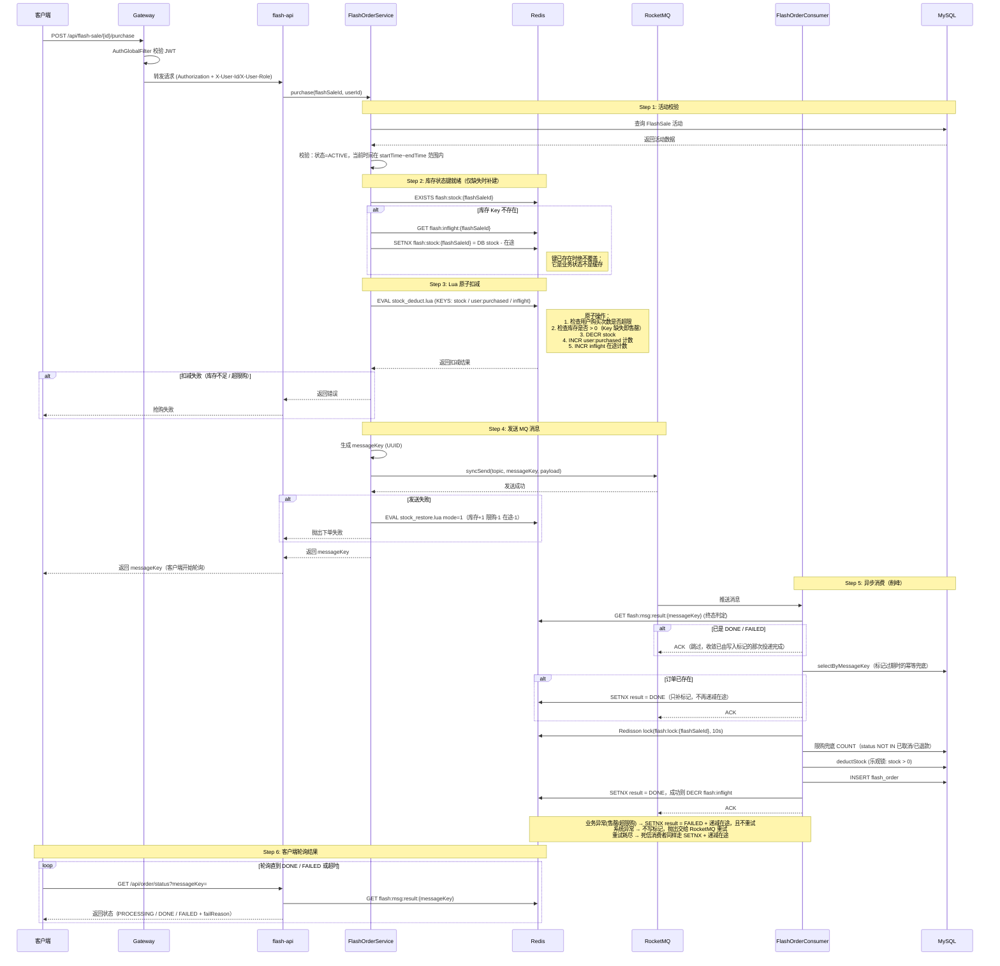

# 秒杀下单核心链路

> 这是整个系统最关键的业务链路，请重点理解。

## 关键设计要点

1. **Lua 脚本保证原子性** — 库存扣减、用户购买计数与在途计数在单次 Redis 调用中原子完成，避免竞态条件。脚本细节见 [Redis Lua 脚本](../development/redis-lua.md)。
2. **同步发送 + 异步消费** — `syncSend` 确保消息到达 Broker，消费者异步处理实现削峰。
3. **messageKey 轮询机制** — 客户端拿到 messageKey 后轮询 Redis 中的处理状态，实现异步转同步的用户体验。
4. **多重幂等保障** — Redis 终态标记 SETNX（消息级）→ DB messageKey 查询（标记过期后兜底）→ `message_key` UNIQUE 索引（并发级）→ Redisson 分布式锁 + DB 乐观锁（数据级）。
5. **库存键是业务状态，不是缓存** — `flash:stock:{id}` 只由 `FlashStockState` 读写：缺失时按 `DB stock − flash:inflight:{id}` 用 SETNX 补建，已存在时任何路径（含管理端更新、缓存失效）都不得覆盖或删除。**唯一例外是管理端把非活跃场次重新激活**：上一周期的键仍持有旧 DB stock 算出的值，若直接沿用则停售期间调大的库存永不生效，因此激活前先删除旧键，再由 `warmUpRedis` 按新 `DB stock − 在途` 重建（非活跃状态无购买流量，删除是安全的）。在途计数由预扣 Lua `+1`、由终态标记的 SETNX 胜出者 `-1`，保证每笔预扣恰好收敛一次；多减会放出虚假库存（超卖方向），少减只会保守地少卖。
