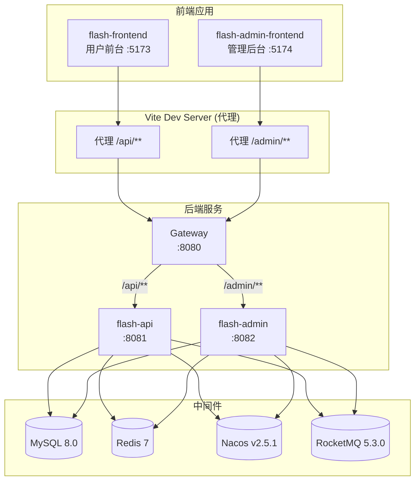

# 系统架构总览

> 本文面向新入职开发者，帮助快速理解秒杀系统的整体架构、技术选型和各模块职责。

## 1. 系统架构总览

**请求流转路径：** 浏览器 → Vite Dev Server（开发环境代理） → Gateway（统一入口、鉴权、路由转发） → 后端业务服务 → 中间件。

**监控数据流：** 应用暴露 `/actuator/prometheus` 端点 → Prometheus 每 15s 拉取（Pull）→ Grafana 连接 Prometheus 查询展示 → Sentinel Dashboard 动态推送流控/熔断规则。详见[可观测性](./observability.md)。

## 2. 技术栈

| 分类 | 技术 | 版本 | 说明 |
|------|------|------|------|
| 语言 | Java | 21 | 主开发语言 |
| 框架 | Spring Boot | 3.2.0 | 应用基础框架 |
| 微服务 | Spring Cloud | 2023.0.0 | 微服务基础设施 |
| 微服务 | Spring Cloud Alibaba | 2023.0.1.0 | Nacos 集成 |
| ORM | MyBatis-Plus | 3.5.5 | 数据库访问层 |
| 数据库 | MySQL | 8.0 | 关系型数据库 |
| 缓存 | Redis 7 + Caffeine 3.1.8 + Redisson | 3.24.3 | 缓存 + 分布式锁 |
| 消息队列 | RocketMQ Server | 5.3.0 | 异步削峰 |
| 消息队列 | rocketmq-spring-boot-starter | 2.3.0 | MQ 客户端 |
| 注册中心 | Nacos | v2.5.1 | 服务注册与配置中心 |
| 认证 | jjwt | 0.12.3 | JWT 令牌生成与校验 |
| 前端（用户端） | Vue 3 + Vite | - | 用户前台 SPA |
| 前端（管理端） | Vue 3 + Element Plus | - | 管理后台 SPA |
| 容器化 | Docker | - | 中间件部署 |
| 监控采集 | Prometheus | v2.53.0 | 时序数据库 + 告警引擎（拉模式） |
| 监控可视化 | Grafana | 11.1.0 | 仪表盘可视化（连接 Prometheus 数据源） |
| 熔断降级 | Sentinel | 1.8.8 | 业务层流控/熔断/系统保护（Dashboard 动态推送规则） |
| 节点指标 | Node Exporter | v1.8.1 | 暴露宿主机 CPU/内存/磁盘指标 |

::: warning 版本冻结
技术栈有意冻结（Boot 3.2 已过 OSS EOL，属知情决策）。未经维护者明确要求，请勿在 PR 中顺手升级框架/中间件版本，详见 [CONTRIBUTING](https://github.com/lark5480/flash-sale/blob/master/CONTRIBUTING.md#版本冻结策略)。
:::

## 3. 模块职责

项目采用 Maven 多模块结构，各模块职责如下（依赖链与包结构详见[模块依赖与包结构](../development/structure.md)）。

### flash-common（公共基础）

通用工具与基础设施，无业务逻辑。

- `ResultVO` / `ResultCode` — 统一响应封装
- `BaseEntity` — 实体基类（id, createTime, updateTime）
- `JwtUtil` — JWT 令牌工具类
- `PasswordUtil` — BCrypt 密码加密
- `SnowflakeIdGenerator` — 雪花 ID 生成器（自定义 epoch + 时钟回滚保护）
- `RateLimit` — 接口限流注解
- 全局异常与异常处理器
- 常量类：`RedisConstants`、`RocketMQConstants`
- `JacksonConfig` — 注解驱动 Long→String 序列化（解决 JS 雪花 ID 精度丢失）

### flash-model（数据模型）

纯数据定义层，不含任何业务逻辑。

- **实体类**：`User`、`Item`、`FlashSale`、`FlashOrder`
- **DTO**：前端入参映射对象
- **VO**：前端出参视图对象
- **枚举**：`FlashSaleStatusEnum`（PENDING / ACTIVE / ENDED）、`OrderStatusEnum`（PENDING / PAID / CANCELLED）

### flash-mapper（数据访问层）

MyBatis-Plus Mapper 接口。

- `FlashSaleMapper` 包含自定义 SQL：
  - `deductStock` — 乐观扣减库存（`stock = stock - #{quantity} WHERE stock >= #{quantity}`）
  - `restoreStock` — 库存回滚（`stock = stock + #{quantity}`）

### flash-service（业务逻辑层）

核心业务实现，包含服务层、配置类和 MQ 生产者/消费者。

- **配置类**：`RedisConfig`、`CacheConfig`（Caffeine 三级缓存 L1）、`IdGeneratorConfig`（雪花 ID Bean）、`AsyncConfig`（空，已迁至 MQ）
- **DataInitRunner** — 应用启动时初始化数据的钩子
- **FlashOrderProducer** — 秒杀下单消息生产者（syncSend 同步发送）
- **RateLimitInterceptor** — 接口限流拦截器（Redis ZSET 滑动窗口）
- **CaptchaService** — 算术验证码服务（生成 + 校验，Redis 存储，一次性消费）
- **FlashOrderConsumer** — 秒杀下单消息消费者（终态标记 SETNX + DB messageKey 幂等 + Redisson 锁 + 事务扣库存+创建订单；业务终态失败吞没不重试、系统异常 re-throw 交给 MQ 重试，重试耗尽由 FlashOrderDeadLetterConsumer 补写 FAILED；失败标记形如 `FAILED:原因`，轮询接口据此回传 `failReason`）

### flash-api（用户端 API，端口 8081）

面向 C 端用户的 REST 接口。

- `AuthController` — 用户注册、登录、刷新 Token、获取验证码
- `FlashSaleController` — 秒杀活动列表、详情、抢购下单（需验证码）
- `FlashOrderController` — 下单、订单状态轮询、订单列表、支付、取消、退款、删除
- `ItemController` — 商品信息查询
- `CaptchaController` — 生成算术验证码
- `WebMvcConfig` — 注册 RateLimitInterceptor

### flash-admin（管理端 API，端口 8082）

面向运营管理人员的后台 REST 接口。

- `AdminAuthController` — 管理员登录（需验证码）
- 商品 / 秒杀活动 / 订单 / 用户 的 CRUD 管理
- `CaptchaController` — 生成算术验证码
- `WebMvcConfig` — 注册 RateLimitInterceptor
- **定时任务调度器**：`FlashSaleScheduler`、`OrderScheduler`（详见[定时任务与消费者隔离](./scheduling-and-isolation.md)）

### flash-gateway（网关，端口 8080）

基于 Spring Cloud Gateway 的统一入口。

- `AuthGlobalFilter` — JWT 鉴权过滤器（白名单放行 + 校验 Token；请求进入网关即**统一剥离**客户端自带的 `X-User-Id`/`X-User-Role` 头，鉴权通过后才按 JWT 中的真实身份**重写**这两个头。该头不是信任边界，鉴权与归属判断仍一律以下游重解析的 Token 为准）
- CORS 跨域配置
- 路由规则：
  - `/api/**` → `flash-api`（lb://flash-api）
  - `/admin/**` → `flash-admin`（lb://flash-admin）
  - `/images/**` → `flash-api`（静态图片资源）
