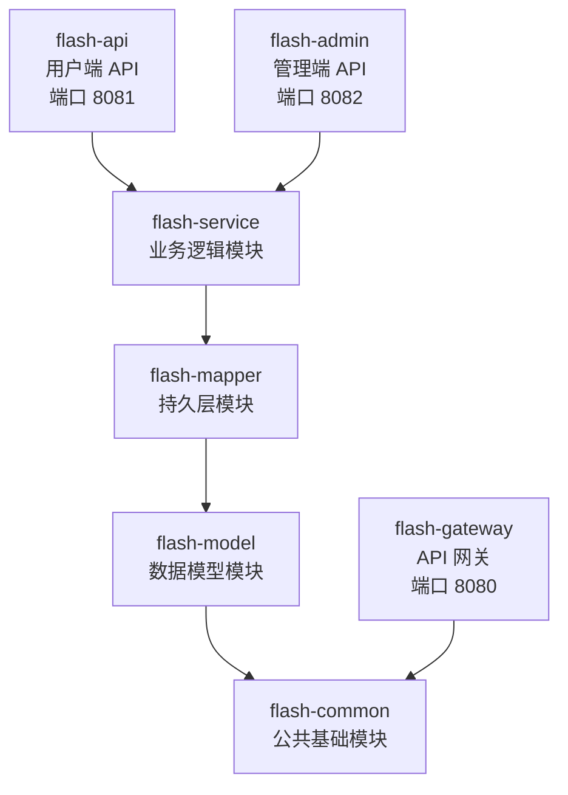

# 模块依赖与包结构

## 1. 项目模块依赖关系

本项目采用 Maven 多模块结构，基于 Spring Boot 3.2 + Spring Cloud 2023 + Spring Cloud Alibaba 构建。各模块之间的依赖关系如下：



**依赖说明：**

| 模块 | 依赖 | 说明 |
|------|------|------|
| flash-common | 无 | 公共工具类、异常处理、统一返回、常量定义 |
| flash-model | flash-common | 实体类、DTO、VO、枚举 |
| flash-mapper | flash-model | MyBatis-Plus Mapper 接口 |
| flash-service | flash-mapper | 业务逻辑实现、Redis/MQ 配置、消息生产与消费 |
| flash-api | flash-service | 用户端 REST 控制器，同时承载 MQ 消费者 |
| flash-admin | flash-service | 管理端 REST 控制器、定时任务调度器 |
| flash-gateway | flash-common | 仅依赖 JwtUtil 做 Token 校验，不依赖业务层 |

**端口分配：**

| 服务 | 端口 |
|------|------|
| flash-gateway | 8080 |
| flash-api | 8081 |
| flash-admin | 8082 |
| flash-frontend（用户前端） | 5173 |
| flash-admin-frontend（管理前端） | 5174 |

**中间件依赖：**

| 中间件 | 用途 | 配置地址 |
|--------|------|----------|
| MySQL 8.0 | 持久化存储 | 127.0.0.1:3306，数据库 `flash_sale` |
| Redis | 库存预扣、缓存、分布式锁、幂等校验 | 127.0.0.1:6379 |
| RocketMQ | 异步下单消息队列 | 127.0.0.1:9876 |
| Nacos | 服务注册与发现 | 127.0.0.1:8848 |

::: warning Redis 必须用 docker-compose 的 `flash-redis` 容器
不要额外在 Windows 上安装 Redis 服务：本地 Redis 默认绑 `127.0.0.1:6379`，容器绑 `0.0.0.0:6379`，两者能同时"起来"，但连 `127.0.0.1` 时精确绑定优先 → 应用连的是本地 Redis，而 `docker exec flash-redis redis-cli` 查的是容器，排查缓存时会出现"明明没键"的假象。详见[常见问题排查](../deployment/troubleshooting.md)。
:::

## 2. 包结构规范

基础包路径 `com.flashsale.{模块}`。完整包结构如下：

```
com.flashsale
├── common                          # flash-common 模块
│   ├── result                      # 统一返回结果
│   │   ├── ResultVO                # 统一返回包装类
│   │   └── ResultCode              # 错误码枚举
│   ├── exception                   # 自定义异常
│   │   ├── BusinessException       # 业务异常
│   │   ├── UnauthorizedException   # 未授权异常
│   │   └── ForbiddenException      # 禁止访问异常
│   ├── handler
│   │   └── GlobalExceptionHandler  # 全局异常处理器
│   ├── util                        # 工具类
│   │   ├── JwtUtil                 # JWT 令牌工具
│   │   ├── PasswordUtil            # 密码加密工具
│   │   └── SnowflakeIdGenerator    # 雪花 ID 生成器（自定义 epoch + 时钟回滚保护）
│   ├── config
│   │   ├── MyMetaObjectHandler     # MyBatis-Plus 自动填充处理器
│   │   └── JacksonConfig           # Jackson JSON 序列化配置（Long→String 解决 JS 精度丢失）
│   ├── constant                    # 常量定义
│   │   ├── RedisConstants          # Redis Key、TTL 常量与缓存防护工具方法
│   │   └── RocketMQConstants       # RocketMQ Topic/Tag/Group 常量
│   ├── annotation
│   │   └── RateLimit               # 接口限流注解
│   └── enums
│       └── StatusEnum              # 通用状态枚举
│
├── model                           # flash-model 模块
│   ├── entity                      # 数据库实体
│   │   ├── User                    # 用户
│   │   ├── Item                    # 商品
│   │   ├── FlashSale               # 秒杀活动
│   │   └── FlashOrder              # 秒杀订单
│   ├── dto                         # 请求数据传输对象
│   │   ├── LoginDTO                # 登录请求
│   │   └── RegisterDTO             # 注册请求
│   ├── vo                          # 返回视图对象
│   │   ├── LoginVO                 # 登录返回（含 Token）
│   │   ├── UserVO                  # 用户信息
│   │   ├── ItemVO                  # 商品信息
│   │   ├── FlashSaleVO             # 秒杀活动详情（含商品信息）
│   │   ├── FlashOrderVO            # 秒杀订单（含 messageKey）
│   │   └── PageVO                  # 分页封装
│   └── enums                       # 业务枚举
│       ├── FlashSaleStatusEnum     # 秒杀活动状态
│       ├── OrderStatusEnum         # 订单状态
│       └── UserRoleEnum            # 用户角色
│
├── mapper                          # flash-mapper 模块
│   ├── UserMapper                  # 用户 Mapper
│   ├── ItemMapper                  # 商品 Mapper
│   ├── FlashOrderMapper            # 订单 Mapper
│   └── FlashSaleMapper             # 秒杀活动 Mapper
│
├── service                         # flash-service 模块
│   ├── UserService / ItemService / FlashSaleService / FlashOrderService
│   ├── impl                        # Service 实现类
│   ├── config                      # 配置类（RedisConfig、CacheConfig、IdGeneratorConfig、MyBatisPlusConfig、AsyncConfig、DataInitRunner）
│   ├── filter
│   │   └── JwtAuthenticationFilter # Spring Security JWT 过滤器
│   ├── interceptor
│   │   └── RateLimitInterceptor    # 接口限流拦截器（Redis 滑动窗口）
│   ├── producer
│   │   └── FlashOrderProducer      # RocketMQ 消息生产者
│   ├── consumer
│   │   └── FlashOrderConsumer      # RocketMQ 消息消费者（仅 flash-api 启用）
│   └── message
│       └── FlashOrderMessage       # MQ 消息体定义
│
├── api                             # flash-api 模块
│   ├── controller                  # AuthController / CaptchaController / ItemController / FlashSaleController / FlashOrderController
│   └── config                      # ApiSecurityConfig、WebMvcConfig
│
├── admin                           # flash-admin 模块
│   ├── controller                  # AuthController / CaptchaController / ItemController / FlashSaleController / OrderController / UserController
│   ├── config                      # AdminSecurityConfig、WebMvcConfig
│   └── scheduler                   # FlashSaleScheduler、OrderScheduler
│
└── gateway                         # flash-gateway 模块
    ├── GatewayApplication          # 网关启动类
    ├── filter
    │   └── AuthGlobalFilter        # JWT 全局鉴权过滤器
    └── config
        └── CorsConfig              # 跨域配置
```

> 各模块的业务职责说明见[系统架构总览 §3](../architecture/overview.md#_3-模块职责)；编码规范见[代码规范](./code-standards.md)。
